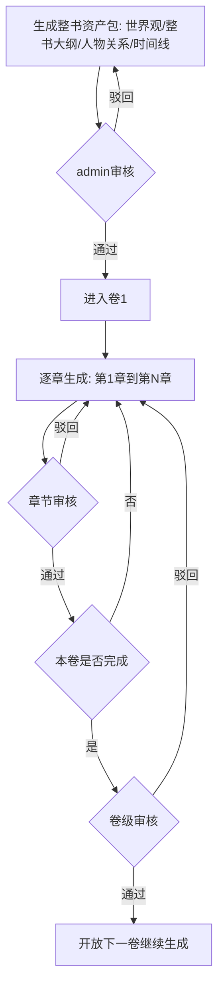

# AI 长篇网文生成平台 — 完整调研与开发

---

## 目录

1. [为什么现有工具"AI味"太重](#1-为什么现有工具ai味太重)
2. [学术文献索引与算法来源](#2-学术文献索引与算法来源)
   - 2.1 长篇故事生成核心论文
   - 2.2 文本风格迁移 / 作者风格模仿
   - 2.3 AIGC检测机制原理
   - 2.4 记忆管理与一致性维护
   - 2.5 算法→工程映射总表
3. [参考小说四层解析与世界观迁移体系](#3-参考小说四层解析与世界观迁移体系)
   - 3.1 设计哲学：什么可以迁移，什么必须原创
   - 3.2 四层解析架构
   - 3.3 层一：表层文体（可完全迁移）
   - 3.4 层二：叙事结构（可部分迁移）
   - 3.5 层三：世界观氛围（选择性迁移）
   - 3.6 层四：情节/人物/剧情（禁止迁移，必须原创）
   - 3.7 参考小说解析引擎工程实现
   - 3.8 世界观迁移的隔离机制
4. [文学技法全景拆解](#4-文学技法全景拆解)
5. [文学技法→工程化映射表](#5-文学技法工程化映射表)
6. [系统整体架构](#6-系统整体架构)
7. [各引擎详细设计](#7-各引擎详细设计)
8. [Prompt 工程体系](#8-prompt-工程体系)
9. [记忆管理系统设计](#9-记忆管理系统设计)
10. [前端工作台设计](#10-前端工作台设计vitepress)
11. [数据库 Schema 设计](#11-数据库-schema-设计)
12. [技术栈选型与依赖清单](#12-技术栈选型与依赖清单)
13. [开发路线图与里程碑](#13-开发路线图与里程碑)
14. [风险分析与应对](#14-风险分析与应对)
15. [附录：Prompt 模板库](#15-附录prompt-模板库)

---

## 1. 为什么现有工具"AI味"太重

### 1.1 多层次缺陷综述

| 缺陷层次 | 具体表现 | 对应检测方式 |
|---------|---------|------------|
| **逻辑结构线性** | 段落呈"问题→分析→结论"线性结构 | 逻辑指纹识别 |
| **叙事视角僵化** | 全文锁死单一视角，无自然漂移 | 视角一致性检测 |
| **时间结构单一** | 只会直叙，不用插叙/倒叙/预叙 | 叙事结构分析 |
| **情感直白表达** | "他很伤心"而非具象化行为 | 情感密度与类型分析 |
| **句式均匀** | 句子长度标准差过低（Burstiness偏低）| 统计爆发度检测 |
| **困惑度偏低** | 词汇选择概率过高，缺乏"意外"词汇 | Perplexity检测 |
| **对话模板化** | 每句对话完整规范，无省略无打断 | 对话特征向量 |
| **主语全程在场** | 每个句子都有明确主语 | 句法分析 |
| **侧写缺失** | 直接描写人物，不借环境/他人烘托 | 描写模式分类 |
| **感官单一** | 以视觉描写为主，嗅觉触觉听觉稀少 | 感官词汇分布 |
| **插叙/倒叙缺失** | 线性推进，无回忆、无闪回、无预示 | 叙事时间分析 |

---

## 2. 学术文献索引与算法来源

> 以下论文直接对应平台各引擎的设计依据，每条注明"→ 本平台对应组件"。

---

### 2.1 长篇故事生成核心论文

#### [P1] Re3 — Recursive Reprompting and Revision
- **论文**：Yang et al., *Re3: Generating Longer Stories With Recursive Reprompting and Revision*, EMNLP 2022
- **arXiv**：https://arxiv.org/abs/2210.06774
- **GitHub**：https://github.com/yangkevin2/emnlp22-re3-story-generation
- **核心算法**：
  1. 先用 LLM 生成结构化全书 Plan（大纲）
  2. 生成段落时，将 Plan + 当前故事状态同时注入 Prompt（双轨注入）
  3. 多个续写候选 → 按连贯性和前提相关性重排序 → 选最优
  4. Edit 模块：提取角色属性键值对，检测前后矛盾，控制编辑修正
- **实验结论**：相比直接生成，Re3 使连贯情节比例提升 14%，前提相关性提升 20%
- **→ 本平台对应**：章节写作引擎的"双轨上下文注入"设计（大纲 + 故事状态双轨），Edit 模块对应一致性校验器

---

#### [P2] DOC — Detailed Outline Control
- **论文**：Yang et al., *DOC: Improving Long Story Coherence with Detailed Outline Control*, ACL 2023
- **arXiv**：https://arxiv.org/abs/2212.10077
- **GitHub**：https://github.com/yangkevin2/doc-story-generation
- **核心算法**：
  1. 生成极其详细的分层大纲（不只是章节名，而是每章的具体情节点）
  2. 大纲细化程度：书级 → 章级 → 段级（三层级联细化）
  3. 写作时严格锁定在当前段级大纲约束内，不允许跑偏
  4. 通过 Outline Fidelity 指标评估生成内容对大纲的遵守程度
- **→ 本平台对应**：大纲引擎的三层分级生成（宏观 → 卷 → 章节提纲），写作引擎的大纲遵守约束

---

#### [P3] DOME — Dynamic Hierarchical Outlining with Memory-Enhancement
- **论文**：Wang et al., *Generating Long-form Story Using Dynamic Hierarchical Outlining with Memory-Enhancement*, NAACL 2025
- **arXiv**：https://arxiv.org/abs/2412.13575
- **数据集**：https://github.com/Qianyue-Wang/DOME_dataset
- **核心算法**：
  1. **动态大纲**：大纲不是一次生成固定的，而是随故事推进动态更新
  2. **时序知识图谱**：将角色/地点/物品的状态变化以时序 KG 存储，每步检索确认一致性
  3. **记忆分层**：长期记忆（KG节点）+ 短期记忆（最近2章提纲），分开维护
  4. **冲突率(CR)指标**：新增评估叙事前后冲突程度的自动指标
- **→ 本平台对应**：记忆管理系统的时序 KG 设计，动态大纲的迭代更新机制

---

#### [P4] RecurrentGPT — LSTM-style Long Text Generation
- **论文**：Zhou et al., *RecurrentGPT: Interactive Generation of (Arbitrarily) Long Text*, arXiv 2023
- **arXiv**：https://arxiv.org/abs/2305.13304
- **GitHub**：https://github.com/aiwaves-cn/RecurrentGPT
- **核心算法**：用自然语言模拟 LSTM 的记忆门控机制
  ```
  每个时间步 t：
  输入: 当前段落任务 + 上段末尾计划
  长期记忆(ct): 所有已生成章节摘要的语义检索（存硬盘，向量检索）
  短期记忆(ht): 最近几步的关键信息（维护在 Prompt 中）
  输出: 新段落内容 + 下段计划（3-5句）+ 更新后的短期记忆
  ```
- **关键参数**：每段生成 200-400 字内容 + 3-5 句下段计划
- **→ 本平台对应**：章节写作引擎的滑动窗口设计，短/长期记忆双轨架构直接采用此论文结构

---

#### [P5] SCORE — Story Coherence and Retrieval Enhancement
- **论文**：Yi et al., *SCORE: Story Coherence and Retrieval Enhancement for AI Narratives*, arXiv 2025
- **arXiv**：https://arxiv.org/abs/2503.23512
- **三大组件**：
  1. **动态状态追踪**（Dynamic State Tracking）：用符号逻辑监控关键叙事元素（角色/物品）的状态，自动检测并修正不一致
  2. **上下文感知摘要**（Context-Aware Summarization）：层级化情节摘要，捕捉情感进展
  3. **混合检索**（Hybrid Retrieval）：向量检索 + 符号逻辑双路召回，回答"前文中X是否做过Y"类一致性查询
- **→ 本平台对应**：质检引擎的逻辑一致性校验器，角色状态追踪器的符号逻辑设计

---

#### [P6] GROVE — RAG for Complex Story Generation
- **论文**：Wen et al., *GROVE: A Retrieval-augmented Complex Story Generation Framework with A Forest of Evidence*, EMNLP Findings 2023
- **核心算法**：
  - 构建"证据森林"（Forest of Evidence）：将故事中所有已确立的事实构建成多棵检索树
  - 生成新段落时，从证据森林中检索相关事实，确保生成内容不违反已确立事实
  - 应对复杂多线叙事时的一致性维护
- **→ 本平台对应**：向量数据库设计中"世界观知识库"的检索树结构，伏笔管理器的事实约束

---

#### [P7] Agents' Room — Multi-step Narrative Collaboration
- **论文**：Huot et al., *Agents' Room: Narrative Generation through Multi-step Collaboration*, arXiv 2024
- **arXiv**：https://arxiv.org/abs/2410.02603
- **核心算法**：多智能体分工协作
  ```
  Planner Agent    → 情节规划、结构决策
  Writer Agent     → 实际文字生成
  Critic Agent     → 质量评审、修改建议
  Character Agent  → 角色行为一致性守护
  ```
- **→ 本平台对应**：四角色评审链（编辑/读者/审稿/反AI检测），章节生成的多智能体架构

---

#### [P8] SWAG — Storytelling With Action Guidance
- **论文**：Patel et al., *SWAG: Storytelling With Action Guidance*, EMNLP Findings 2024
- **arXiv**：https://arxiv.org/abs/2410.02603（同 Agents' Room 期刊，独立论文）
- **核心算法**：用强化学习（RL/SFT）训练故事生成模型
  - 定义"故事动作"（story action）：每个叙事决策（视角切换/情节转折/节奏变化）作为可学习的离散动作
  - 奖励函数：连贯性 + 惊喜度 + 情感投入度的加权组合
- **→ 本平台对应**：长期可基于此思路对写作引擎进行强化学习微调（Phase 5 进阶方向）

---

#### [P9] Improving Pacing in Long-Form Story Planning
- **论文**：Wang et al., *Improving Pacing in Long-Form Story Planning*, arXiv 2023
- **核心算法**：
  - 定义"叙事节奏"为情绪张力的时序函数
  - 在大纲规划阶段引入节奏约束：哪些章节是高潮，哪些是缓冲，按照规定节奏曲线生成
  - 自动节奏评估指标：基于情感词典的段落张力评分
- **→ 本平台对应**：大纲引擎中的"情感曲线规划"，质检引擎的"爽点密度分析"

---

### 2.2 文本风格迁移 / 作者风格模仿

#### [S1] STYLL — Low-Resource Authorship Style Transfer
- **论文**：Patel et al., *Low-Resource Authorship Style Transfer: Can Non-Famous Authors Be Imitated?*, arXiv 2022/2024
- **arXiv**：https://arxiv.org/abs/2212.08986
- **核心算法**：
  1. 从目标作者的少量样本（约16篇/500词）中提取风格
  2. 用 LLM 生成"伪平行数据"（pseudo-parallel transfer pairs）
  3. 将风格描述符（Style Descriptors）+ 伪平行对注入 LLM Prompt 完成迁移
  4. 用 UAR（Unmasked Authorship Recognition）评估风格迁移准确率
- **关键结论**：仅需约 500 词的参考样本即可实现较好的风格迁移（低资源场景）
- **→ 本平台对应**：素材引擎的"风格指纹提取"，参考书无需全文扫描，选取典型章节片段即可

---

#### [S2] TinyStyler — Few-Shot Style Transfer with Authorship Embeddings
- **论文**：Horvitz et al., *TinyStyler: Efficient Few-Shot Text Style Transfer with Authorship Embeddings*, arXiv 2024
- **arXiv**：https://arxiv.org/abs/2406.15586
- **核心算法**：
  1. 使用预训练的"作者身份嵌入"（Authorship Embeddings）将作者风格编码为向量
  2. 小模型（800M参数）+ 作者风格向量 = 超越 GPT-4 的风格迁移效果
  3. 内容保留（Content Preservation）+ 风格准确度（Style Accuracy）双指标评估
- **关键结论**：风格向量比"用自然语言描述风格"更精准，可以用于细粒度的风格控制
- **→ 本平台对应**：参考书风格指纹不只用自然语言描述，同时维护风格向量（bge-m3 编码），写作时双路注入

---

#### [S3] Text Style Transfer Survey — 方法论全景
- **论文**：Survey on Text Style Transfer: Applications and Ethical Implications, arXiv 2024
- **arXiv**：https://arxiv.org/abs/2407.16737
- **核心方法分类**：
  ```
  风格迁移方法树
  ├── 监督方法（有平行语料）
  │   └── Seq2Seq（编码器-解码器）
  ├── 无监督方法（无平行语料）← 本平台使用
  │   ├── 删除-重写（Delete-and-Rewrite）
  │   │   └── 删除风格特征词 → 用目标风格重填充
  │   ├── 解耦-重组（Disentangle-and-Recombine）
  │   │   └── 内容向量 + 风格向量分别编码，重组时替换风格向量
  │   └── 约束解码（Constrained Decoding）
  │       └── 推理时用词汇约束引导生成方向
  └── 基于LLM的方法 ← 本平台主要使用
      ├── Zero-shot（直接Prompt）
      ├── Few-shot（样例注入）← STYLL / TinyStyler
      └── 动态Prompt生成（根据待迁移文本自适应调整Prompt）
  ```
- **→ 本平台对应**：素材引擎使用 Few-shot 注入，人性化管道使用约束解码思路（词汇约束 + 句式约束）

---

#### [S4] Authorship Style Transfer with Policy Optimization
- **论文**：*Authorship Style Transfer with Policy Optimization*, arXiv 2024
- **arXiv**：https://arxiv.org/abs/2403.08043
- **核心算法**：DPO（Direct Preference Optimization）训练风格迁移
  - 对同一内容，收集"高风格准确"和"低风格准确"的生成对
  - 用 DPO 优化模型偏好，无需 RL 的不稳定性
- **→ 本平台对应**：Phase 5 进阶方向：用用户修改行为（用户对AI生成内容的改写）构建偏好对，DPO 微调风格迁移模型

---

#### [S5] Beyond the Surface — GPT-4o 文学风格模仿研究
- **来源**：*Beyond the surface: stylometric analysis of GPT-4o's capacity for literary style imitation*, Digital Scholarship in the Humanities, 2025
- **核心结论**：
  - Prompt 工程是风格模仿成功的最关键因素（比模型选择更重要）
  - Zero-shot 风格模仿失败率极高（准确率 < 7%）
  - 提供少样本示例 + 开头引导段落（initial portion）的组合效果最好
  - 风格模仿的主要失败点：词汇频率分布、标点使用习惯、句子复杂度（非内容本身）
- **→ 本平台对应**：素材引擎提取的风格指纹必须包含标点习惯、词汇频率分布、句子复杂度这三项，不能只描述"文风"

---

### 2.3 AIGC检测机制原理

#### [D1] Perplexity + Burstiness 双指标检测体系
- **来源**：*Detecting AI-Generated Text: Factors Influencing Detectability with Current Methods*, arXiv 2024
- **arXiv**：https://arxiv.org/abs/2406.15583
- **核心指标**：
  ```
  困惑度（Perplexity）:
    - 定义：语言模型对文本的预测难度
    - AI特征：词汇选择符合最高概率分布 → 困惑度低
    - 人类特征：使用低概率词汇 → 困惑度高（有"意外"词汇）
    
  爆发度（Burstiness）:
    - 定义：句长分布的变异系数（CV = 标准差/均值）
    - AI特征：句长均匀，CV低
    - 人类特征：句长极端变化，CV高（有极短和极长句的混合）
  ```
- **最新进展（DivEye, arXiv 2025）**：仅凭困惑度已不够，需要更高阶的"惊讶度序列统计特征"
- **→ 本平台对应**：人性化管道 Step7（句长分布优化）直接针对 Burstiness 指标；Step4（情绪替换）通过引入低概率词汇提升 Perplexity

---

#### [D2] DetectGPT / Binoculars — 白盒检测
- **DetectGPT**：Mitchell et al., 2023
- **Binoculars**：Hans et al., 2024
- **核心算法**：
  - DetectGPT：检测文本在概率空间的局部曲率（人类文本在局部极大值，AI文本更平坦）
  - Binoculars：使用两个不同 LLM 的交叉困惑度作为检测信号（更鲁棒）
- **DIPPER（Google Research）**：T5 paraphrasing 模型可绕过上述检测 → 说明语义保留的改写是有效的检测规避手段
- **→ 本平台对应**：人性化管道的"语义保留改写"思路（DIPPER-style），不改意思只改表达形式

---

#### [D3] DAMAGE — 检测"AI生成后人类修改"的混合文本
- **论文**：*DAMAGE: Detecting Adversarially Modified AI Generated Text*, arXiv 2025
- **arXiv**：https://arxiv.org/abs/2501.03437
- **核心结论**：
  - 现有"AI人性化工具"绕过检测有效，但产生了可识别的"humanization fingerprint"（人性化指纹）
  - 最有效的规避方式：不是全量改写，而是**有针对性地修改 AI 特征最明显的片段**
  - 建议：混合策略（高 AI 特征段落重写，低 AI 特征段落保留）比全量改写更自然
- **→ 本平台对应**：质检引擎的"片段级 AI 率检测"——不是给整章打分，而是定位 AI 特征最高的具体段落，精准触发人性化管道

---

### 2.4 记忆管理与一致性维护

#### [M1] Generative Agents — 记忆模块设计
- **论文**：Park et al., *Generative Agents: Interactive Simulacra of Human Behavior*, 2023
- **记忆三层架构（直接被本平台采用）**：
  ```
  感知记忆（Sensory）: 原始输入，短暂保留
  工作记忆（Working）: 当前上下文窗口，积极使用
  长期记忆（Long-term）: 向量数据库存储 + 语义检索
  ```
- **记忆检索公式**：
  ```
  relevance_score = α × recency + β × importance + γ × relevance
  （近期性 × 权重 + 重要性 × 权重 + 语义相关性 × 权重）
  ```
- **→ 本平台对应**：记忆管理系统三层架构（Redis热/PG温/向量DB冷），章节重要性评分

---

#### [M2] Lost in the Middle — LLM长上下文使用偏差
- **论文**：Liu et al., *Lost in the Middle: How Language Models Use Long Contexts*, TACL 2024
- **核心发现**：LLM 在处理长输入时，对开头和结尾的信息权重远高于中间部分（U形注意力分布）
- **工程含义**：关键信息必须放在 Prompt 的开头或结尾，不能放中间
- **→ 本平台对应**：上下文构建器的信息排布策略：
  - Prompt 开头：世界观规则 + 绝对约束（禁止行为）
  - Prompt 中间：角色状态、前情摘要（允许被"遗忘"的部分）
  - Prompt 结尾：本章任务 + 章末钩子要求（最重要，放最后）

---

#### [M3] HiAgent — 层级工作记忆管理
- **论文**：Hu et al., *HiAgent: Hierarchical Working Memory Management for Long-horizon Agent Tasks*, arXiv 2024
- **核心算法**：将工作记忆按层次组织，高层抽象+低层细节，按需加载
- **→ 本平台对应**：大纲引擎的层级记忆（书级摘要→卷级摘要→章级细节按需展开）

---

### 2.5 算法→工程映射总表

| 算法/论文 | 对应平台组件 | 实现优先级 |
|----------|------------|---------|
| Re3 双轨注入 [P1] | 章节写作引擎上下文构建器 | P0 |
| DOC 三层大纲 [P2] | 大纲引擎分层生成 | P0 |
| DOME 动态大纲+时序KG [P3] | 记忆管理 + 大纲迭代更新 | P1 |
| RecurrentGPT LSTM记忆 [P4] | 滑动窗口长短期记忆双轨 | P0 |
| SCORE 混合检索+状态追踪 [P5] | 质检一致性校验 + 角色追踪器 | P1 |
| GROVE 证据森林 [P6] | 向量DB世界观知识检索树 | P1 |
| Agents' Room 多智能体 [P7] | 四角色评审链 | P0 |
| SWAG 行动引导 [P8] | 叙事技法参数注入 | P2 |
| Pacing 节奏规划 [P9] | 情感曲线 + 爽点密度分析 | P1 |
| STYLL 低资源风格迁移 [S1] | 参考书风格指纹提取（少样本） | P0 |
| TinyStyler 风格向量 [S2] | 风格嵌入向量（bge-m3） | P1 |
| TST Survey 方法论 [S3] | 人性化管道约束解码思路 | P0 |
| DPO风格对齐 [S4] | Phase 5 模型微调 | P2 |
| Perplexity+Burstiness [D1] | 质检引擎AI率自测 | P0 |
| DAMAGE 片段级检测 [D2] | 精准触发人性化管道 | P1 |
| Generative Agents记忆 [M1] | 三层记忆架构设计 | P0 |
| Lost in the Middle [M2] | Prompt 信息排布策略 | P0 |
| HiAgent 层级记忆 [M3] | 大纲层级记忆管理 | P1 |

---

## 3. 参考小说四层解析与世界观迁移体系

> **核心设计哲学**：参考小说不是"抄"，是"学"。
> 用户提供参考书的目的是：迁移描写风格和叙事氛围，创造完全不同的剧情和人物。
> 这需要一套精准的四层解析体系，明确区分"可迁移层"和"必须原创层"。

---

### 3.1 设计哲学：什么可以迁移，什么必须原创

```
参考小说解析维度
                  ┌─────────────────────────────────────────┐
允许完全迁移  →   │ 层一：表层文体（写法、句式、感官偏好）    │
                  ├─────────────────────────────────────────┤
允许部分迁移  →   │ 层二：叙事结构（时序习惯、视角切换模式）  │
                  ├─────────────────────────────────────────┤
选择性迁移    →   │ 层三：世界观氛围（基调、力量体系框架）    │
                  ├─────────────────────────────────────────┤
完全禁止迁移  →   │ 层四：情节/人物/对话（必须100%原创）      │
                  └─────────────────────────────────────────┘
```

**以《诡秘之主》为参考书举例**：

| 迁移层 | 可以迁移什么 | 不能迁移什么 |
|--------|------------|------------|
| 层一（文体） | 克制的文风，大量留白，内心独白用破折号引导 | × |
| 层二（叙事） | 第三人称限制视角，偶尔全知越界两句 | × |
| 层三（氛围） | 维多利亚蒸汽朋克氛围感，神秘学体系的"代价"设定思路 | 序列名、神祇名、克莱恩这个角色 |
| 层四（情节） | × | 整个剧情、人物关系、所有已知情节 |

---

### 3.2 四层解析架构

```
参考书 PDF
    │
    ▼
┌────────────────────────────────────────┐
│          四层解析引擎                   │
├──────────────────┬─────────────────────┤
│   文体解析器      │    叙事结构解析器     │
│   (层一提取)      │    (层二提取)        │
├──────────────────┼─────────────────────┤
│   氛围提取器      │    内容隔离器         │
│   (层三提取)      │    (层四识别+封存)    │
└──────────────────┴─────────────────────┘
    │                         │
    ▼                         ▼
可迁移素材库               原创隔离区（只读，
（写作时RAG注入）           仅用于对比验证，
                           禁止向生成引擎注入）
```

---

### 3.3 层一：表层文体（可完全迁移）

**提取内容**：

```go
type StyleLayer struct {
    // 句式统计
    AvgSentenceLength    float64
    SentenceLengthStdDev float64
    ShortSentenceRatio   float64  // ≤8字比例
    LongSentenceRatio    float64  // ≥25字比例
    
    // 标点与特殊句式
    DashInnerMonologueRate float64 // "——"引导内心独白频率
    EllipsisRate           float64 // "……"省略号使用频率
    QuestionAtLineEndRate  float64 // 以疑问句结尾段落比例
    
    // 词汇特征（基于 jieba 分词 + TF-IDF）
    HighFreqAdverbs    []string // 高频副词（习惯用哪些副词修饰）
    HighFreqVerbs      []string // 高频动词（动作描写偏好）
    RareWordRate       float64  // 低频词汇使用率（越高越"文学"）
    
    // 感官分布
    SensoryDistribution map[string]float64  // visual/auditory/tactile/olfactory/gustatory
    
    // 情绪表达方式
    DirectEmotionRate   float64  // "他很X"直写比例
    BehaviorEmotionRate float64  // 行为代情绪比例
    SensoryEmotionRate  float64  // 感官代情绪比例
    
    // 自然语言风格描述（供 Prompt 使用）
    NLDescription       string   // 从以上数据自动生成的文字描述
}
```

**提取算法**：

```python
# 层一提取示例（Python sidecar 服务）
import jieba
import jieba.analyse
from collections import Counter
import re

def extract_style_layer(text: str) -> StyleLayer:
    sentences = split_sentences(text)
    
    # 句长统计
    lengths = [len(s) for s in sentences]
    avg = np.mean(lengths)
    std = np.std(lengths)
    
    # 感官词词库分类
    sensory_counts = count_sensory_words(text, SENSORY_LEXICON)
    
    # 情绪表达方式分类
    direct_count = count_pattern(text, DIRECT_EMOTION_PATTERNS)
    behavior_count = count_pattern(text, BEHAVIOR_EMOTION_PATTERNS)
    
    # 标点特征
    dash_rate = text.count('——') / len(sentences)
    
    return StyleLayer(
        avg_sentence_length=avg,
        std=std,
        short_ratio=sum(1 for l in lengths if l<=8) / len(lengths),
        sensory_distribution=sensory_counts,
        direct_emotion_rate=direct_count / len(sentences),
        behavior_emotion_rate=behavior_count / len(sentences),
        dash_inner_monologue_rate=dash_rate,
        nl_description=generate_nl_description(...)
    )
```

**风格指纹 → Prompt 自然语言转换示例**：

```
输入：《诡秘之主》风格指纹数据
  - avg_sentence_length: 14.2
  - std: 11.8（高变异）
  - short_ratio: 0.31
  - sensory: {visual: 0.52, tactile: 0.28, auditory: 0.15, olfactory: 0.05}
  - behavior_emotion_rate: 0.68
  - dash_rate: 0.23

输出：写作风格自然语言描述
  "你的写作风格：句子长度高度不规则，情绪激烈时习惯用
   3-5字的短促句，平静叙述时展开成25字以上的长句。
   不写'他感到X'，改用触觉和视觉细节暗示情绪。
   内心独白常用'——'引导，不用'他心想'。
   每写3-4个动作段落，插入一处触觉描写（冷/热/质感）。"
```

---

### 3.4 层二：叙事结构（可部分迁移）

**提取内容**：

```go
type NarrativeStructureLayer struct {
    // 视角习惯
    POVType              string    // 第一/限制第三/全知/混合
    POVDriftFrequency    float64   // 视角越界频率（每千字次数）
    POVSwitchPattern     string    // 视角切换模式描述
    
    // 时序习惯
    ChronologicalRatio   float64   // 直叙比例
    FlashbackFrequency   float64   // 插叙/倒叙频率（每章次数）
    FlashbackReturnType  []string  // 插叙回归方式（感官锚/动作切/对话切）
    ProlepticFrequency   float64   // 预叙频率
    
    // 段落结构
    AvgParaPerChapter    float64   // 每章平均段落数
    DialogueDensity      float64   // 对话占比
    DescriptionDensity   float64   // 描写占比
    
    // 侧写使用
    SidelongWritingRate  float64   // 侧写使用频率
    SidelongTypes        []string  // 惯用侧写类型（他人反应/环境/道具/对比）
}
```

**时序结构提取算法**：

```python
def detect_flashback(paragraph: str, context: str) -> FlashbackInfo:
    """
    检测插叙/倒叙的触发和回归方式
    用启发式规则 + LLM 辅助分类
    """
    # 时态标记词检测
    past_markers = ["那时", "当年", "三年前", "记得", "曾经", "那个夏天"]
    return_markers_sensory = ["气味", "声音", "触感", "温度"]  # 感官锚点回归
    return_markers_action = ["转身", "站起", "回过头"]  # 动作切回归
    
    has_flashback = any(m in paragraph for m in past_markers)
    return_type = detect_return_type(paragraph, context)
    
    return FlashbackInfo(
        has_flashback=has_flashback,
        trigger_type=detect_trigger(paragraph),  # 感官触发/对话触发/意识流
        return_type=return_type
    )
```

---

### 3.5 层三：世界观氛围（选择性迁移）

> **这是最需要人工判断的层次**：平台提取后呈现给 admin，由 admin 选择哪些氛围元素保留用于新故事。

**提取内容**：

```go
type WorldAtmosphereLayer struct {
    // 时代/场景感
    TemporalSetting   string    // 古代/近代/现代/未来/架空
    TechnologicalLevel string   // 蒸汽朋克/魔法/科技/混合
    SocialAtmosphere  string    // 宫廷/江湖/都市/末世等
    
    // 世界观基调
    ToneDescriptions  []string  // 严肃/诙谐/黑暗/热血/悬疑等（多选）
    PowerSystemType   string    // 力量体系类型（序列/境界/职业等框架类型，不含具体名词）
    PowerSystemRules  []string  // 力量体系的规律性规则（有代价/有限制/可修炼等框架特征）
    
    // 描写风格基调（区别于层一的量化指标，这里是定性描述）
    EnvironmentTone   string    // 环境描写的情感基调
    ConflictStyle     string    // 冲突风格（智斗/武力/心理/政治等）
    
    // 特征词汇域
    SignatureVocabDomains []string  // 标志性词汇来自的领域（神学/医学/军事等）
}
```

**admin 决策界面**（前端）：

参考书解析完成后，前端展示"氛围迁移选择器"，让 admin 勾选：
```
√ 维持【蒸汽朋克 × 维多利亚】时代背景感
√ 维持【力量体系有代价/有限制】的框架思路
× 不迁移具体世界名称和地名
× 不迁移序列/境界命名体系（重新命名）
√ 维持【黑暗+悬疑】的整体基调
√ 维持【神学词汇域】风格（使用宗教/神秘学相关词汇氛围）
× 不迁移具体神祇/教派设定
```

---

### 3.6 层四：情节/人物/剧情（禁止迁移，必须原创）

**隔离机制**：

层四内容在解析完成后**存入"隔离区"数据库**：
- 隔离区是只读的
- 写作引擎、大纲引擎、创意引擎**均无权限访问隔离区**
- 隔离区只开放给"原创性验证器"使用，用于检测生成内容是否过于接近原著

**原创性验证器**：

```go
type OriginalityChecker struct {
    // 对每个生成的章节，与隔离区进行比较
    // 使用向量余弦相似度，阈值 > 0.7 触发警告
}

func (c *OriginalityChecker) Check(generatedText string) OriginalityReport {
    // 1. 情节相似度（事件序列比对）
    // 2. 人物行为相似度（角色行为向量比对）  
    // 3. 对话相似度（对话内容向量比对，注意：风格相似不等于内容相似）
    // 返回相似度分数 + 高危段落标记
}
```

**提取内容（仅存隔离区）**：
- 所有人物姓名、绰号
- 主要情节事件序列
- 标志性对话片段（直接引语）
- 具体地名、组织名、物品名
- 标志性剧情转折点描述

---

### 3.7 参考小说解析引擎工程实现

#### 完整解析流程

```
1. PDF/TXT上传
        │
        ▼
2. 文本清洗（去除目录/章节号/广告文字）
        │
        ▼
3. 章节切分（按章节/分节线/段落块切分）
        │
        ▼
4. 并行四层提取（Python sidecar 服务）
   ├── 层一：统计分析（正则+jieba）
   ├── 层二：结构分析（LLM辅助分类）
   ├── 层三：氛围提取（LLM + 关键词）
   └── 层四：情节提取（LLM + NER）→ 直接存隔离区
        │
        ▼
5. 风格向量化（bge-m3 或 text-embedding-3-small）
   ├── 场景类型向量（battle/romance/suspense等分类）
   ├── 感官素材向量（各类感官描写片段）
   └── 叙事技法标注（每段标注使用了哪些技法）
        │
        ▼
6. 存入向量数据库（可迁移素材）
   + 存入隔离区数据库（层四内容）
        │
        ▼
7. 生成可视化报告（风格指纹雷达图、叙事结构统计）
```

#### 技术选型

| 任务 | 工具 | 备注 |
|------|------|------|
| PDF提取 | pdfcpu（Go）或 pdfminer.six（Python）| Python sidecar 处理 |
| 中文分词 | jieba（Python）| 支持自定义词典（加入参考书专有名词） |
| 情感分析 | SnowNLP / HanLP | 中文情绪词典 |
| 命名实体识别 | HanLP（Java）或 spacy + zh_core | 提取人名/地名存隔离区 |
| 向量编码 | bge-m3（本地，中文效果佳）或 OpenAI text-embedding-3-small | bge-m3 更适合中文文学 |
| 风格分类 | LLM（Claude/GPT-4o）+ few-shot | 结构/氛围的定性分类 |

---

### 3.8 世界观迁移的隔离机制

**数据库权限控制**：

```sql
-- 创建隔离区
CREATE SCHEMA quarantine_zone;

CREATE TABLE quarantine_zone.plot_elements (
    id          UUID PRIMARY KEY,
    material_id UUID REFERENCES reference_materials(id),
    element_type VARCHAR(30),  -- character/plot/dialogue/location/item
    content     TEXT,
    vector      VECTOR(1024),
    created_at  TIMESTAMP DEFAULT NOW()
);

-- 生成引擎数据库角色（只能访问主Schema）
CREATE USER generation_engine WITH PASSWORD '...';
GRANT USAGE ON SCHEMA public TO generation_engine;
REVOKE ALL ON SCHEMA quarantine_zone FROM generation_engine;

-- 原创性检查数据库角色（可读隔离区，但不写主Schema）
CREATE USER originality_checker WITH PASSWORD '...';
GRANT SELECT ON quarantine_zone.plot_elements TO originality_checker;
```

**Golang 中间件层隔离**：

```go
// 写作引擎调用时，强制排除隔离区检索
func (e *WriterEngine) BuildContext(params ChapterParams) Context {
    // 只允许从以下集合检索：
    allowedCollections := []string{
        "style_samples",      // 层一素材
        "narrative_samples",  // 层二素材
        "atmosphere_samples", // 层三素材
        "world_knowledge",    // admin定义的新世界观
        "character_voices",   // admin定义的新角色
    }
    // 绝对禁止访问 quarantine_zone
    return e.vectorDB.Search(query, allowedCollections)
}
```

---

### 3.9 参考书"世界观迁移"完整使用流程

```
Step 1: admin 上传参考书（《诡秘之主》PDF）
         ↓
Step 2: 系统运行四层解析，生成报告
         ↓
Step 3: admin 在"氛围迁移选择器"中勾选迁移选项
        ✓ 蒸汽朋克时代背景感
        ✓ 力量体系有代价的框架
        ✗ 具体序列设定
        ✓ 黑暗悬疑基调
         ↓
Step 4: admin 输入"原创点子"
        例："我想写一个故事，主角是一个清朝末年的落魄秀才，
            意外获得了某种古老存在的馈赠，在不断变强的过程中
            逐渐揭开这个世界的真相"
         ↓
Step 5: 创意引擎在以下约束下工作：
        - 使用admin选择的氛围参数（黑暗/悬疑/代价式力量体系）
        - 时代背景改为清末（不是维多利亚），蒸汽朋克改为"东洋蒸汽"变体
        - 全新的力量体系命名和规则
        - 全新的人物和剧情
         ↓
Step 6: 写作引擎生成章节时：
        - 风格参数注入（层一+层二的迁移素材，通过RAG检索）
        - 氛围参数注入（层三选择的内容转化为自然语言描述）
        - 绝对不注入层四内容（隔离区完全隔离）
         ↓
Step 7: 质检引擎最后运行原创性检查
        - 确认生成内容与原著相似度 < 阈值
        - 输出原创性报告
```

---

## 4. 文学技法全景拆解

> 以下每项技法均包含：**定义** / **人类写作示例** / **AI 常见错误** / **工程化实现思路**

---

### 4.1 叙事视角体系

#### 视角类型分类

```
叙事视角
├── 第一人称（"我"）
│   ├── 可靠叙述者
│   └── 不可靠叙述者（对读者隐瞒/欺骗）
├── 第二人称（"你"）— 少见，沉浸感强
├── 第三人称
│   ├── 全知视角（上帝视角，知晓所有角色内心）
│   ├── 限制性视角（跟随单一角色的感知边界）
│   └── 客观视角（只描述外部行为，不入内心）
└── 多视角交替（章节或场景级别切换视角）
```

#### 视角漂移（最重要的人味技法之一）

**定义**：在以某一视角为主的叙事中，允许叙述者"越界"短暂进入另一角色或更高视角，然后自然收回。

**人类写作示例**：
```
// 主视角是李明（限制性第三人称）
李明看着她转身离去，脚步比来时快了许多。
他不知道，就在转过街角的瞬间，她停下来，
用手背抹了一下眼角。
然后继续走。
```
> 前半段是李明的感知，后半段越过了李明的视角边界——但写得克制（只一两句），制造叙事张力。

**AI 的常见错误**：要么全程严格限制在一个视角内（过于机械），要么随意全知（没有张力）。

---

#### 不可靠叙述者

**示例**：
```
他对我很好的，你们不了解他。那次他摔门，
是因为我先说错了话。那次他没来，
是因为他太忙了。他一直都很忙。
```
> 读者能感知到叙述者在自我说服，但叙述者本身没有意识到。

**工程化实现**：为特定角色创建"认知偏差档案"（合理化/否认/投射等类型），在该角色作为叙述者时注入其偏差模式。

---

### 4.2 时间叙述结构

#### 四种基本时序

```
时间叙述结构
├── 直叙（顺叙）— 事件按发生顺序呈现
├── 倒叙 — 先呈现结果/未来，再回溯原因
├── 插叙 — 主线推进中插入过去事件
│   ├── 场景插叙（完整呈现过去场景）
│   └── 摘要插叙（简述过去而不展开）
└── 预叙（前瞻）— 叙述者预示未来发生的事
    ├── 明确预叙（"后来他才明白……"）
    └── 暗示预叙（伏笔性细节，读者事后回看才察觉）
```

#### 感官锚点回归技法（极重要）

插叙结束时，禁止使用"想到这里，他回过神来"（典型 AI 写法）。
应该用**感官细节**完成时间回归：

```
// 禁止（AI写法）
想到那年的事，他心里一阵酸楚。回过神来，他发现……

// 推荐（人类写法）
……那是十四岁的夏天，蝉鸣震耳欲聋。
身后传来脚步声。
他转过头。
```

**理论来源**：参照 [P4] RecurrentGPT 的"感官触发器"思路，将回忆触发和回忆结束都锚定在感官细节上。

---

### 4.3 省略与留白技法

#### 主语省略（汉语特有技法）

**AI 写法（错误）**：
```
他走进房间。他脱下外套。他看了一眼镜子。
```

**人类写法**：
```
走进房间，脱下外套，在镜子前停了一下。
```

**工程化实现**：后处理正则规则：检测同主语连续动作 → 压缩为逗号连排动词组

#### 对话省略

**AI 写法（错误）**：
```
"你去哪里了？"李华问道。
"我去图书馆了。"王明回答说。
```

**人类写法**：
```
"去哪了？"
"图书馆。"
```

省略规则：短回答（≤6字）删除发话动词；问句删除"问道"；交替对话可省略主语。

#### 结尾留白

**AI 写法**：
```
他看着那封信，心中充满了悲伤与遗憾，
泪水不禁流了下来。
```

**人类写法**：
```
他把信折好，放回信封。
窗外的雨小了，但不知道什么时候开始的。
```

---

### 4.4 侧写与间接呈现

#### 侧写定义与分类

**直写（AI常见方式）**：
```
陈总是一个让人畏惧的人，声音低沉有威慑力。
```

**侧写（人类写作方式）**：
```
陈总走进来的时候，会议室里有人
不动声色地把手机屏幕扣下去了。
```

```
侧写类型
├── 他人反应侧写 — 通过周围人的反应折射主体
├── 环境侧写 — 通过环境细节暗示人物/事件
├── 道具侧写 — 通过物品暗示人物性格/状态
├── 对比侧写 — 通过与另一人/事的对比呈现
└── 行为侧写 — 通过细小的习惯性动作揭示性格
```

---

### 4.5 场景转换与视角切换

#### 碰面后视角切换（重点技法）

**示例**：
```
// 段落1：A的视角
李云在人群里认出了她。
她剪了头发，短了很多，刘海压着眉毛。
走路的姿势还是那样——右脚稍微外八。

// 空白行（不写过渡句）

// 段落2：切换为B的视角
陈夏看到他的瞬间，脚步慢了半拍。
他消瘦了。
```

**场景转换类型**：
```
场景转换技法
├── 硬切（Hard Cut）— 无过渡直接跳到新场景（空白行）
├── 溶入（Dissolve）— 用共同元素连接两个场景
│   └── 例：上场景的火光 → 下场景的烛光
├── 声音桥（Sound Bridge）— 上场景的声音延续到下场景画面
├── 时间压缩（Ellipsis）— "三年过去了"
└── 意识流场景转换 — 通过角色联想自然漂移
```

---

### 4.6 声音与叙述距离

#### 自由间接引语（Free Indirect Discourse）— 最重要的人味技法之一

**普通第三人称（AI常用）**：
```
他心想，这件事可能没那么简单。
```

**自由间接引语（人类写作）**：
```
这件事，可能没那么简单。
```

**进阶使用**（多技法叠加示例）：
```
陈夏低头看着那张便条。
走了？
就这么走了？
不等她解释一句。
她把便条揉成团，扔进了垃圾桶。
又捡出来，展开，压平。
留着干什么？
她自己也不知道。
```
> 包含：自由间接引语、省略主语、行为留白（矛盾动作）、主语省略——四个人味技法同时运作

---

### 4.7 节奏控制技法

**快节奏（冲突/动作场景）**：
```
门撞开了。
他进来。
她没有转身。
"出去。"
他没动。
```

**慢节奏（沉思/情绪场景）**：
```
她站在阳台上，看着楼下的行道树在风里一摇一摆，
叶子落了一地，被扫树叶的老人一点一点归拢过去，
又被下一阵风吹散。
```

**工程化实现**：参照 [P9] Pacing 论文，将节奏控制量化为段落级张力评分，驱动句长分布目标参数：

| 场景类型 | 目标平均句长 | 目标标准差 |
|---------|-----------|---------|
| 动作/冲突 | ≤8字 | ≤3 |
| 普通叙事 | 10-20字 | ≥8 |
| 情感/沉思 | ≥20字 | ≥12 |

---

### 4.8 对话工程

#### 对话的七个人味维度

1. **打断**：`"我只是想说，当时的情况——" / "当时的情况我也在。"`
2. **转移话题**：问"你去哪了"，答"今天吃什么？"
3. **答非所问**：`"你后悔吗？" / "那天的烤鱼很好吃。"`
4. **重复确认**：`"他走了。" / "走了？" / "走了。"`（三句话，信息量为零，情绪满格）
5. **半句话**：`"如果那天我没有……" 她摇摇头，"算了。"`
6. **潜台词**：表面说A，实际含义是B
7. **动作锚点**：对话前后嵌入行为代替"他说/她答"

---

### 4.9 感官具象化

#### 五感分工表

| 感官 | 适用情绪/场景 | 示例 |
|------|-------------|------|
| 视觉 | 中性/开阔 | "光从百叶窗缝隙穿进来，把地板切成一条一条" |
| 听觉 | 紧张/孤独 | "走廊尽头有钟，走一秒，停两秒，再走一秒" |
| 触觉 | 亲密/痛苦 | "他把钱放进她手里，硬币的边缘还是热的" |
| 嗅觉 | 记忆/怀旧 | "旧书和樟脑球的气味让她想起三楼的储物间" |
| 味觉 | 极端情绪 | "嘴里是铁锈的味道，他意识到自己咬破了嘴唇" |
| 本体感觉 | 恐惧/虚弱 | "脚像不是自己的，踩下去，地面比预期的更近" |

---

## 5. 文学技法→工程化映射表

| 技法 | 工程化组件 | 算法依据 | 优先级 |
|------|----------|---------|-------|
| 视角漂移 | 视角越界控制器（Prompt参数） | [P2] DOC视角约束 | P0 |
| 不可靠叙述者 | 角色认知偏差档案 | — | P1 |
| 倒叙/插叙 | 时序结构规划器 + 感官锚点检测 | [P4] RecurrentGPT | P0 |
| 预叙/伏笔 | 伏笔管理器（全局追踪） | [P1] Re3 Edit模块 | P0 |
| 主语省略 | 省略规则引擎（正则后处理）| [D3] DAMAGE启发 | P0 |
| 对话省略 | 对话压缩器（规则后处理）| — | P0 |
| 结尾留白 | 情绪直白检测 + 侧写替换 | [S3] TST删除-重写 | P0 |
| 侧写 | 侧写触发器 + 侧写素材库RAG | [S1] STYLL素材 | P0 |
| 碰面视角切换 | 双视角分块生成器 | [P7] Agents' Room | P1 |
| 自由间接引语 | FID注入器（去除"他心想"）| — | P0 |
| 叙述距离调节 | 叙述距离控制器（Prompt参数）| [P9] Pacing | P1 |
| 句长节奏控制 | Burstiness优化器 | [D1] 检测论文反向 | P0 |
| 感官具象化 | 感官素材RAG + 注入器 | [S1]+[S2] 风格迁移 | P0 |
| 章末钩子 | 钩子类型参数 + 模板库 | [P9] Pacing | P0 |
| 参考书风格迁移 | 四层解析引擎 + 风格向量 | [S1][S2][S3] | P0 |
| 原创性验证 | 隔离区相似度检测 | [S4][S5] 作者归因 | P0 |
| Perplexity提升 | 低频词汇注入（情绪替换）| [D1] 反向工程 | P0 |
| Burstiness提升 | 句长方差优化器 | [D1] 反向工程 | P0 |

---

## 6. 系统整体架构

### 6.1 完整数据流

```
admin输入（点子 + 参考书 + 类型偏好 + 氛围选择）
    │
    ├──────────────────────────────────────────────┐
    │（参考书走独立管道）                            │
    ▼                                              ▼
创意引擎                                     四层解析引擎
（点子扩展/世界观/人物）                   （层一-四提取）
    │                                              │
    │                                     ┌────────┴────────┐
    ▼                                     ▼                  ▼
大纲引擎                              可迁移素材库        隔离区数据库
（含伏笔管理器/时序规划器）           （向量DB）         （只读，不接入生成）
    │                                     │
    └──────────────┬───────────────────────┘
                   ▼
           上下文构建器
           （Re3双轨注入 + Lost-in-Middle排布策略）
                   │
                   ▼
              AI 网关层（多模型路由）
                   │
                   ▼
            LLM流式生成
                   │
                   ▼
          人性化管道（8步顺序处理）
          Step1: 逻辑指纹破碎
          Step2: 主语省略引擎
          Step3: 对话压缩器
          Step4: 情绪直白替换
          Step5: 感官具象化注入（RAG）
          Step6: 自由间接引语转换
          Step7: Burstiness优化（句长分布）
          Step8: 叙事时序校验
                   │
                   ▼
          质检引擎
          ├── AI率自测（Perplexity + Burstiness估算）
          ├── 原创性检查（对比隔离区）
          ├── 爽点密度分析（[P9] Pacing指标）
          ├── 逻辑一致性（[P5] SCORE符号逻辑）
          └── 伏笔检查（管理器追踪）
                   │
          达标？──┬── 否 → 回流（带标注问题点）
                  │
                  是
                  ▼
           存储 + 推送前端
```

### 6.2 人工审核门控与步骤回退（Human-in-the-Loop Workflow）

> 平台默认采用“admin 审核门控”模式：每一步产物必须经 admin 确认，才允许进入下一步。

```
Step A 生成候选结果
  ↓
Step B admin 审核
  ├── 通过：进入下一步
  ├── 驳回：原步骤重生成（保留审核意见）
  └── 回退：跳回任意已完成步骤并恢复该步骤快照
  ↓
Step C 记录审计日志（谁、何时、为何通过/驳回/回退）
```

门控规则：
- `strict_review=true` 时，任何自动链路都不得越过“admin审核”环节。
- 每一步都保存可恢复快照（参数、上下文、产物、质检结果）。
- 回退后重新生成时，沿用目标步骤快照并合并admin新指令，保证可解释与可复现。
- 系统为单管理员私用模式：固定 `admin` 操作，无登录/注册/RBAC 账号体系。

分层门控（必须按顺序）：
1. 整书资产包审核：世界观、整书大纲、人物关系图、全局时间线必须全部 `approved`，否则禁止进入章节生成。
2. 章节逐章生成：每次只生成 1 章，状态默认为 `draft`，admin 在章节管理中“通过/驳回/重生成/回退”。
3. 卷级审核门：当一卷章节全部完成后，必须先卷级审核通过，才允许开启下一卷生成。

默认交互策略：
- 系统生成的一切内容默认是草稿（`draft`），不会直接下沉为正式版本。
- 驳回后只重生成当前步骤，不影响已通过步骤。
- 回退到历史步骤后，后续未通过步骤自动标记为需重审（`needs_recheck`）。

### 6.3 同世界观衍生约束层（World Bible Constitution）

> 核心目标：沿用同一套底层世界观设定，生成全新事件链、全新人物关系、全新冲突路径。

```yaml
world_bible_constitution:
  immutable_rules:        # 不可变规则（必须继承）
    - 时代与技术边界
    - 力量体系底层公理
    - 世界级资源约束
    - 社会结构硬规则

  mutable_rules:          # 可变规则（鼓励创新）
    - 新势力组织与地缘结构
    - 新角色族群与关系网络
    - 新冲突主题与价值命题

  forbidden_anchors:      # 禁止继承（原创性红线）
    - 原著角色名/组织名/地名
    - 原著标志性事件序列
    - 原著标志性台词与桥段
```

在系统流上，所有生成链路统一先读 `immutable_rules`，再按任务动态注入 `mutable_rules`，并在生成后对 `forbidden_anchors` 做段落级扫描与回流重写。

### 6.4 分阶段生成与继续生成控制（Split Generation Policy）



核心策略：
- 继续生成入口只在章节管理页触发，不在后台自动串行到底。
- 下一章生成前会校验：上一章必须为 `approved`，本卷必须处于 `drafting`。
- 下一卷生成前会校验：上一卷必须为 `approved`。

---

## 7. 各引擎详细设计

### 7.1 AI 网关层（Golang）

**参考项目**：
- bifrost（Go LLM gateway）：https://github.com/maximhq/bifrost
- pLLM 架构思路

**模型路由策略**：

| 任务类型 | 首选模型 | 备用模型 | 理由 |
|---------|---------|---------|------|
| 世界观/人物设计 | Claude Opus | GPT-4o | 创意推理 |
| 章节写作（古风/仙侠）| 文心一言 4.5 | DeepSeek-V3 | 中文古典语感 |
| 章节写作（都市）| DeepSeek-V3 | GPT-4o | 中文网文语感 |
| 章节写作（科幻）| Claude Sonnet | GPT-4o | 逻辑严密 |
| 人性化后处理 | DeepSeek-V3 | GPT-4o-mini | 速度/稳定性 |
| 质检分析 | GPT-4o-mini | DeepSeek-V3 | 分析类 |

---

### 7.2 章节写作引擎

基于 [P1] Re3 + [P4] RecurrentGPT 的混合实现：

```go
type ChapterGenerationParams struct {
    // 叙事参数
    NarrativeOrder      NarrativeOrder  // 直叙/含插叙/含倒叙/混合
    FlashbackTrigger    string          // 触发感官描述
    FlashbackReturnMethod string        // 感官锚 / 动作切 / 对话切
    
    // 视角参数
    PrimaryPOV          string
    AllowPOVDrift       bool
    POVDriftMaxSentences int            // 越界最多几句
    POVSwitches         []POVSwitch     // 碰面视角切换点
    
    // 叙述距离（参考[P9] Pacing）
    NarrativeDistance   DistanceLevel   // Summary/Scene/Close/Stream
    FIDFrequency        int             // 每N字一处自由间接引语
    
    // 节奏（参考[P9]）
    TargetPace          PaceType
    TensionCurve        []float64       // 段级张力目标值
    
    // 省略控制（基于[D3] DAMAGE发现）
    SubjectOmissionLevel int            // 0-3
    EmotionDirectnessLevel int         // 0=全侧写, 3=允许直写
    
    // 对话技法
    AllowedDialogueTechniques []DialogueTechnique
    
    // 伏笔任务
    ForeshadowTasks     []ForeshadowTask
    
    // 钩子
    EndHookType         HookType
    EndHookStrength     int             // 1-5
    
    // 风格迁移（参考[S1][S2]）
    StyleVectors        []float32       // 参考书风格向量
    StyleNLDescription  string          // 自然语言风格描述
}
```

---

### 7.3 素材引擎（参考书四层解析）

**Python sidecar 服务接口**：

```python
# reference_analyzer/main.py
from fastapi import FastAPI
from models import ReferenceBook, FourLayerAnalysis

app = FastAPI()

@app.post("/analyze")
async def analyze_reference(book: ReferenceBook) -> FourLayerAnalysis:
    text = extract_text(book.pdf_path)
    chapters = split_chapters(text)
    
    # 并行四层提取
    layer1 = extract_style_layer(chapters)         # 统计分析
    layer2 = extract_narrative_structure(chapters)  # LLM辅助
    layer3 = extract_atmosphere(chapters)           # LLM + 关键词
    layer4 = extract_plot_elements(chapters)        # LLM + NER（→隔离区）
    
    # 向量化并存储
    style_vectors = vectorize_samples(layer1.samples, "bge-m3")
    store_to_vectordb(style_vectors, collection="style_samples")
    store_to_quarantine(layer4)  # 隔离区
    
    return FourLayerAnalysis(
        layer1=layer1,
        layer2=layer2,
        layer3=layer3,
        layer4_summary="已存入隔离区，不开放访问"
    )
```

---

### 7.4 人性化管道（8步）

参考 [D1] Perplexity+Burstiness、[D3] DAMAGE、[S3] TST 的方法论：

#### Step 7 — Burstiness 优化器（算法细节）

```python
def optimize_burstiness(text: str, target_cv: float = 0.8) -> str:
    """
    CV（变异系数）= 标准差/均值
    人类写作目标：CV > 0.7（高变异）
    AI 生成问题：CV < 0.4（低变异）
    """
    sentences = split_sentences(text)
    lengths = [len(s) for s in sentences]
    current_cv = np.std(lengths) / np.mean(lengths)
    
    if current_cv >= target_cv:
        return text  # 不需要优化
    
    # 策略1：选最长句（>25字）拆成2-3个短句
    # 策略2：选连续短句（<8字）合并为一个长句
    # 策略3：在动作快节奏段插入极短句（1-4字）
    
    # 调用 LLM 执行重写
    return rewrite_with_burstiness_target(text, target_cv)
```

#### Step 4 — 情绪直白替换器（提升 Perplexity）

核心思路来自 [D1]：AI 生成的情绪词汇困惑度低（高概率词），替换为行为/感官描写时使用低概率词汇，从而提升整体 Perplexity：

```python
DIRECT_EMOTION_PATTERNS = [
    r"(他|她|它|我)(感到|觉得|心里|内心)(很|非常|十分)?[\u4e00-\u9fa5]{2,6}",
    r"(悲伤|高兴|愤怒|恐惧|难过|感动|委屈|绝望|惊喜|痛苦)",
]

def replace_direct_emotion(text: str, style_vectors: list) -> str:
    matches = detect_direct_emotions(text, DIRECT_EMOTION_PATTERNS)
    for match in matches:
        emotion_type = classify_emotion(match)
        # 从风格素材库RAG检索对应的侧写表达
        replacement = rag_retrieve_sidelong(
            emotion=emotion_type,
            style_vectors=style_vectors,
            method=["behavior", "sensory", "environment"]  # 优先级顺序
        )
        text = text.replace(match, replacement)
    return text
```

---

### 7.5 质检引擎

基于 [P5] SCORE + [P9] Pacing + [D1] 检测理论：

```go
type QualityReport struct {
    // AI率估算（基于内部统计，非调第三方API）
    EstimatedPerplexity    float64  // 越高越像人类
    EstimatedBurstiness    float64  // CV，越高越像人类
    AIScoreEstimate        float64  // 综合AI率估算（0-100，越低越好）
    
    // 原创性检查
    OriginalityScore       float64  // 与隔离区相似度（越低越好）
    SuspiciousSegments     []string // 相似度过高的段落标记
    
    // 文学技法使用度（对比参考书层二数据）
    NarrativeTechUsage     map[string]float64  // 各技法使用频率
    TechGapAnalysis        map[string]float64  // 与参考书的差距
    
    // 爽点分析（基于[P9]）
    TensionCurve           []float64  // 段落级张力评分序列
    RewardDensity          float64    // 每千字爽点数
    HookStrength           float64    // 章末钩子强度
    
    // 一致性（基于[P5] SCORE）
    WorldConsistency       bool
    CharacterConsistency   bool
    TimelineConsistency    bool
    ConflictRateScore      float64    // [P3] DOME的CR指标
    
    // 整体
    OverallScore           float64
    PassThreshold          bool
    Issues                 []QualityIssue  // 带段落定位的问题列表
}
```

### 7.6 剧情差异化引擎（Plot Divergence Engine）

> 目标：同设定衍生时，保证“世界观同源”但“剧情骨架不重合”。

```go
type DivergenceGuard struct {
  MinEventGraphDistance   float64 // 事件图最小编辑距离阈值
  MaxRoleFunctionOverlap  float64 // 角色功能位重叠上限
  MaxPlotPathSimilarity   float64 // 主线路径相似度上限
}

type DivergenceReport struct {
  EventGraphDistance    float64
  RoleFunctionOverlap   float64
  PlotPathSimilarity    float64
  HighRiskSegments      []string
  Pass                  bool
}
```

运行流程：
1. 先生成候选剧情骨架（主冲突、关键转折、阶段目标）。
2. 与隔离区原著事件图进行图距离比对（不是只比文本向量）。
3. 对高风险骨架节点触发重规划，再进入章节生成。
4. 章节生成后做二次审查，若相似度回升则定点回流改写。

建议阈值（可配置）：
- `EventGraphDistance >= 0.55`
- `RoleFunctionOverlap <= 0.35`
- `PlotPathSimilarity <= 0.40`

### 7.7 章节继续生成控制器（Chapter Continue Controller）

> 目标：保证章节生成严格按“上一章已审通过 -> 才能生成下一章”的交互节奏进行。

```go
type ContinueGenerationGuard struct {
  ProjectID        string
  CurrentVolumeID  string
  LastChapterNum   int
}

func (g *ContinueGenerationGuard) CanGenerateNext() error {
  if !IsBlueprintApproved(g.ProjectID) {
    return ErrBlueprintNotApproved
  }
  if !IsVolumeOpenForDrafting(g.CurrentVolumeID) {
    return ErrVolumeGateClosed
  }
  if !IsChapterApproved(g.ProjectID, g.LastChapterNum) {
    return ErrPrevChapterNotApproved
  }
  return nil
}
```

控制规则：
1. 章节管理页点击“继续生成”时，先执行 `CanGenerateNext()`。
2. 校验通过才创建下一章草稿（`draft`），并自动进入该章审核视图。
3. 若本卷最后一章已通过，按钮切换为“提交卷审核”，通过后才开放下一卷入口。

### 7.8 工作流状态机与 API 合同（可直接开发）

#### 7.8.1 状态机（Workflow Step State Machine）

| 当前状态 | 允许动作 | 目标状态 | 备注 |
|---------|---------|---------|------|
| pending | generate | generated | 系统创建候选草稿 |
| generated | submit_review | pending_review | 提交 admin 审核 |
| pending_review | approve | approved | 通过后可进入下一步骤 |
| pending_review | reject | rejected | 保留审核意见 |
| rejected | regenerate | generated | 仅重生成当前步骤 |
| approved | rollback | rolled_back | 回退后后续未通过步骤标记 needs_recheck |
| rolled_back | regenerate | generated | 使用快照参数重开 |
| needs_recheck | submit_review | pending_review | 回退链路上的复审入口 |

跨层级门控：
1. `book_blueprints.status=approved` 前，禁止创建任何 chapter step。
2. `volumes.status=approved` 前，禁止开启下一卷第一章。
3. chapter n 未 `approved` 前，禁止生成 chapter n+1。

#### 7.8.2 API 清单（REST）

```http
POST   /api/workflows/{runId}/blueprint/generate
POST   /api/workflows/{runId}/blueprint/submit-review
POST   /api/workflows/{runId}/blueprint/approve
POST   /api/workflows/{runId}/blueprint/reject

POST   /api/workflows/{runId}/chapters/continue        # 只创建下一章草稿
POST   /api/chapters/{chapterId}/submit-review
POST   /api/chapters/{chapterId}/approve
POST   /api/chapters/{chapterId}/reject
POST   /api/chapters/{chapterId}/regenerate

POST   /api/volumes/{volumeId}/submit-review
POST   /api/volumes/{volumeId}/approve
POST   /api/volumes/{volumeId}/reject

POST   /api/workflows/{runId}/rollback
GET    /api/workflows/{runId}/history
GET    /api/workflows/{runId}/diff?fromStepId=...&toStepId=...
```

#### 7.8.3 请求/响应示例

```json
POST /api/chapters/{chapterId}/approve
{
  "reviewComment": "节奏和人物行为一致，通过",
  "strictReview": true
}
```

```json
200 OK
{
  "chapterId": "...",
  "status": "approved",
  "nextAction": "chapter_continue_available"
}
```

```json
POST /api/workflows/{runId}/rollback
{
  "targetStepId": "...",
  "reason": "人物关系设定需要重做"
}
```

```json
200 OK
{
  "runId": "...",
  "currentStepId": "...",
  "status": "rolled_back",
  "markedAsNeedsRecheck": ["step-19", "step-20", "step-21"]
}
```

#### 7.8.4 错误码约定

| 错误码 | 场景 | 说明 |
|------|------|------|
| WF_001 | BlueprintNotApproved | 整书资产未通过，禁止章节生成 |
| WF_002 | PrevChapterNotApproved | 上一章未通过，禁止继续生成 |
| WF_003 | VolumeGateClosed | 当前卷未通过卷级审核 |
| WF_004 | InvalidStateTransition | 非法状态跳转 |
| WF_005 | SnapshotNotFound | 回退目标快照不存在 |
| WF_006 | ConcurrentReviewConflict | 同一 admin 多标签页并发冲突（版本号不一致） |
| WF_007 | StrictReviewRequired | strict_review 模式下缺少审核动作 |

#### 7.8.5 并发与幂等

- 所有写接口要求 `Idempotency-Key`，用于防止重复提交。
- 审核接口要求 `If-Match: <version>`（乐观锁），防止同一 admin 多标签页覆盖。
- `chapters/continue` 必须加项目级互斥锁，避免一次点击生成多章。
- 回退操作是事务化更新：`workflow_steps` + `workflow_reviews` + `workflow_snapshots` 同事务提交。

#### 7.8.6 OpenAPI 草案（核心接口）

```yaml
openapi: 3.0.3
info:
  title: NovelBuilder Workflow API
  version: 1.0.0
paths:
  /api/workflows/{runId}/chapters/continue:
    post:
      summary: 生成下一章草稿（强门控）
      parameters:
        - in: header
          name: Idempotency-Key
          required: true
          schema: { type: string }
      responses:
        "200":
          description: 下一章草稿已创建
        "409":
          description: 门控失败（WF_001/WF_002/WF_003）

  /api/chapters/{chapterId}/approve:
    post:
      summary: 审核通过章节
      parameters:
        - in: header
          name: If-Match
          required: true
          schema: { type: string }
      requestBody:
        required: true
        content:
          application/json:
            schema:
              type: object
              properties:
                reviewComment: { type: string }
      responses:
        "200":
          description: 审核成功
        "409":
          description: 同一 admin 多标签页并发冲突（WF_006）

  /api/workflows/{runId}/rollback:
    post:
      summary: 回退到指定步骤快照
      requestBody:
        required: true
        content:
          application/json:
            schema:
              type: object
              required: [targetStepId, reason]
              properties:
                targetStepId: { type: string, format: uuid }
                reason: { type: string }
      responses:
        "200":
          description: 回退成功
        "404":
          description: 快照不存在（WF_005）
```

#### 7.8.7 状态机执行器（服务端伪代码）

```go
func TransitStep(runID, stepID, action string, version int) error {
    tx := db.Begin()
    defer tx.Rollback()

    step := tx.GetStepForUpdate(stepID)
    if step.Version != version {
        return ErrConcurrentReviewConflict // WF_006
    }

    if !IsTransitionAllowed(step.Status, action) {
        return ErrInvalidStateTransition // WF_004
    }

    if err := EnforceCrossGate(runID, step, action); err != nil {
        return err // WF_001/WF_002/WF_003
    }

    next := NextState(step.Status, action)
    tx.UpdateStepState(stepID, next)
    tx.InsertReviewLog(stepID, action, "admin")

    if action == "rollback" {
        tx.MarkDownstreamAsNeedsRecheck(runID, step.StepOrder)
    }

    return tx.Commit()
}
```

#### 7.8.8 前端按钮门控矩阵与提示文案

| 页面 | 按钮 | 可点击条件 | 不可点击提示 |
|------|------|-----------|-------------|
| 整书资产包 | 提交审核 | 资产包状态为 draft 或 rejected | 当前状态不可提交，请先完成编辑 |
| 整书资产包 | 开始章节生成 | `book_blueprints.status=approved` | 请先通过整书资产包审核 |
| 章节管理 | 继续生成下一章 | 上一章 approved 且当前卷 drafting | 上一章未通过，无法继续生成 |
| 章节管理 | 章节通过 | 当前章 pending_review | 当前章节未进入审核态 |
| 章节管理 | 章节驳回 | 当前章 pending_review | 当前章节未进入审核态 |
| 卷管理 | 提交卷审核 | 本卷章节全部 approved | 本卷仍有未通过章节 |
| 卷管理 | 开启下一卷 | 上一卷 approved | 请先完成上一卷审核 |
| 流程控制台 | 回退到此步骤 | 目标步骤存在快照 | 目标步骤缺少快照，无法回退 |

前端动作规范：
1. 每次状态变更后刷新 `workflow_steps` 与 `chapters` 最新状态，禁用本地乐观跳转。
2. 对 WF 错误码统一弹窗，不展示 HTTP 状态文本。
3. “继续生成”按钮点击后立刻进入 loading+禁用，直到接口返回。

#### 7.8.9 错误码到 admin 提示映射

| 错误码 | admin 提示文案 | 推荐下一步 |
|------|-------------|-----------|
| WF_001 | 请先通过整书资产包审核后再生成章节。 | 前往整书资产页完成审核 |
| WF_002 | 上一章尚未审核通过，暂不能继续。 | 前往章节审核通过上一章 |
| WF_003 | 当前卷尚未通过卷级审核。 | 提交卷审核并处理驳回项 |
| WF_004 | 当前操作与步骤状态不匹配。 | 刷新页面后重试 |
| WF_005 | 未找到可回退快照。 | 选择其他可回退节点 |
| WF_006 | 当前页面版本已过期（可能在另一个标签页已操作）。 | 刷新后重新审核 |
| WF_007 | 当前流程要求先审核，不能直接跳过。 | 执行审核动作后再继续 |

---

## 8. Prompt 工程体系

### 8.1 System Prompt 结构模板

基于 [M2] Lost-in-the-Middle 的信息排布策略（关键信息放开头和结尾）：

```markdown
# [开头区 — 最关键信息] 写作约束（放最前，防止被遗忘）
## 你的角色
你是一位长期写作[题材]小说的资深中文网文作者。

## 风格要求（来自参考书层一提取）
[StyleLayer.NLDescription — 自然语言风格描述]

## 世界观硬约束（来自 World Bible Constitution）
[immutable_rules — 不可变规则摘要]

## 绝对禁止
- 禁止直写情绪（"他感到X"/"她觉得X"）
- 禁止连续3段无感官描写
- 禁止"由此可见"/"不难发现"等论文过渡词
- 禁止每句对话后都加"XX说道"
- 禁止"想到这里"/"回过神来"等直白插叙回归句
- 禁止连续3句以上使用相同句子长度
- 禁止逻辑推进过于完整（主角每次行动应有代价）

# [中间区 — 允许部分遗忘] 背景信息
## 世界观摘要（<500 Token）
[动态注入]

## 出场角色当前状态
[从角色追踪器注入]

## 前5章滚动摘要
[RecurrentGPT式短期记忆注入]

# [结尾区 — 最重要，放最后] 本次任务
## 本章任务
[从大纲引擎获取]

## 本章叙事参数
视角：[参数]
时序：[含插叙触发点和回归方式]
节奏：[各段期望节奏]
自由间接引语：每[N]字一处

## 伏笔任务
埋入：[列表]
回收：[列表]

## 章末钩子
类型：[类型] / 强度：[1-5]

## 感官参考素材（RAG检索结果，100-200字）
[相似场景的感官描写片段]
```

---

### 8.2 四角色评审链（参考 [P7] Agents' Room）

```
角色1：资深网文编辑
  任务：从留存角度评估，指出节奏拖沓/爽点不足/钩子力度

角色2：忠实读者
  任务：指出AI味（对话不自然/情绪直白/叙事僵化）

角色3：逻辑审稿人
  任务：找出世界观/人物/时间线矛盾（[P5] SCORE思路）

角色4：反AI检测专家
  任务：标记高AI特征段落，给出具体改写方向
  要求：不说"修改一下"，要说"第3段的'他感到迷茫'
         改为XX行为/感官表达"（定位到段落级）
```

---

## 9. 记忆管理系统设计

### 9.1 三层记忆架构（基于 [M1] Generative Agents + [P4] RecurrentGPT）

```
层级   存储介质       内容                        生命周期
──────────────────────────────────────────────────────────
L1热   Redis         当前章节上下文               当次生成
       (短期记忆)     前5章摘要（滚动窗口）
                     当前出场角色状态

L2温   PostgreSQL    全部章节文本                 项目全生命周期
       (情节记忆)     章节摘要（压缩版）
                     事件时间线记录（时序KG）
                     伏笔状态追踪

L3冷   向量数据库     世界观设定向量               项目全生命周期
       (语义记忆)     人物描写模式向量
                     参考书风格向量（层一+层二）
                     场景类型向量（RAG使用）
```

### 9.2 检索公式（基于 [M1] Generative Agents）

```python
def retrieval_score(memory_item, query):
    """
    relevance_score = α × recency + β × importance + γ × cosine_sim
    """
    recency = exp_decay(memory_item.created_at, decay_factor=0.99)
    importance = memory_item.importance_score  # 1-10，存储时LLM评分
    relevance = cosine_similarity(
        embed(query),
        memory_item.vector
    )
    return 0.3 * recency + 0.3 * importance + 0.4 * relevance
```

### 9.3 自适应上下文编排器（Adaptive Context Orchestrator）

> 目标：在单次上下文受限时，优先保证“世界观硬约束不丢失”，其次保证当前章节任务可执行。

```python
def build_adaptive_context(task, token_budget):
    hard_constraints = fetch_world_bible_immutable_rules(task.project_id)
    chapter_goal = fetch_current_chapter_goal(task.chapter_id)
    dynamic_state = fetch_dynamic_state(task.project_id)

    # 固定预留：硬约束和本章任务永不裁剪
    reserved = pack(hard_constraints) + pack(chapter_goal)
    remain = token_budget - tokens(reserved)

    # 自适应装载：按相关性与冲突风险排序
    candidates = rank_by(
        dynamic_state,
        key=lambda x: 0.5 * x.semantic_relevance + 0.5 * x.conflict_risk
    )

    selected = greedy_pack(candidates, remain)
    return compose_context(head=hard_constraints, middle=selected, tail=chapter_goal)
```

补充机制：
- 生成前一致性探针：若关键字段缺失（角色状态/时间线锚点），触发二次检索补齐。
- 生成后差异探针：若违反 `immutable_rules`，直接阻断入库并自动回流。

---

## 10. 前端工作台设计（VitePress）

### 10.1 页面清单

```
工作台路由
├── /studio          创意工作室（点子 → 初始概念）
├── /references      参考书管理
│   ├── /references/upload    上传解析
│   ├── /references/:id       四层解析报告（雷达图/统计）
│   └── /references/:id/migrate 氛围迁移选择器
├── /world           世界观编辑器
├── /characters      人物管理（档案卡 + 关系网络图）
├── /outline         大纲编辑器
│   ├── 树状视图
│   ├── 时间线视图
│   └── 伏笔管理看板
├── /chapters        章节管理
│   ├── /chapters/list      章节列表（草稿/待审/通过）
│   ├── /chapters/:id/review 章节审核（通过/驳回/重生成）
│   └── /chapters/continue  继续生成（仅开放下一章）
├── /workflow        流程控制台
│   ├── /workflow/review    步骤审核中心（通过/驳回/回退）
│   ├── /workflow/history   构建历史与版本树
│   └── /workflow/diff      任意两步结果对比
├── /write           章节写作台（核心界面）
│   ├── 左侧：上下文面板
│   ├── 中央：实时生成流 + 段落级批注
│   └── 右侧：参数面板（全部叙事参数调节）
└── /qc              质检仪表盘
    ├── AI率趋势（Perplexity + Burstiness历史曲线）
    ├── 爽点密度热图（情感张力曲线）
    ├── 文学技法使用度雷达图（对比参考书）
    └── 原创性报告
```

### 10.2 参考书解析报告界面

**可视化内容**：
1. **风格指纹雷达图**：6维感官分布 + 情绪表达方式分布
2. **叙事结构饼图**：直叙/插叙/倒叙的比例分布
3. **句长分布直方图**：与AI生成的对比
4. **技法使用频率条形图**：视角漂移/自由间接引语/侧写等各技法频率
5. **氛围迁移选择器**：可视化勾选界面（层三内容）

---

## 11. 数据库 Schema 设计

```sql
-- 参考书表（扩展四层解析）
CREATE TABLE reference_materials (
    id              UUID PRIMARY KEY DEFAULT gen_random_uuid(),
    project_id      UUID REFERENCES projects(id),
    title           VARCHAR(200),
    author          VARCHAR(100),
    genre           VARCHAR(50),
    
    -- 四层解析结果
    style_layer     JSONB,    -- 层一：风格指纹
    narrative_layer JSONB,    -- 层二：叙事结构
    atmosphere_layer JSONB,   -- 层三：世界观氛围
    -- 层四：存入隔离区，不在此表
    
    -- admin迁移选择
    migration_config JSONB,   -- admin勾选的迁移选项
    
    -- 向量集合引用
    style_collection  VARCHAR(100),   -- 向量DB中层一素材集合名
    vector_fingerprint VECTOR(1024),  -- 整体风格向量（bge-m3）
    
    status          VARCHAR(20) DEFAULT 'processing',
    created_at      TIMESTAMP DEFAULT NOW()
);

-- 隔离区（独立Schema）
CREATE SCHEMA quarantine_zone;
CREATE TABLE quarantine_zone.plot_elements (
    id              UUID PRIMARY KEY DEFAULT gen_random_uuid(),
    material_id     UUID,     -- 不使用外键，隔离区独立
    element_type    VARCHAR(30),  -- character/plot/dialogue/location/item
    content         TEXT NOT NULL,
    vector          VECTOR(1024),
    created_at      TIMESTAMP DEFAULT NOW()
);

-- 世界观表
CREATE TABLE world_bibles (
    id          UUID PRIMARY KEY DEFAULT gen_random_uuid(),
    project_id  UUID REFERENCES projects(id),
    content     JSONB NOT NULL,  -- 完整世界观结构
    -- 包含：从参考书迁移的氛围参数 + admin原创设定
    migration_source UUID REFERENCES reference_materials(id),
    version     INT DEFAULT 1,
    updated_at  TIMESTAMP DEFAULT NOW()
);

-- 角色表（含认知偏差档案）
CREATE TABLE characters (
    id              UUID PRIMARY KEY DEFAULT gen_random_uuid(),
    project_id      UUID REFERENCES projects(id),
    name            VARCHAR(100) NOT NULL,
    role_type       VARCHAR(30),
    profile         JSONB NOT NULL,   -- 完整角色档案（含cognitive_bias字段）
    current_state   JSONB,            -- 当前状态
    voice_collection VARCHAR(100),    -- 角色声音向量集合（向量DB）
    created_at      TIMESTAMP DEFAULT NOW()
);

-- 伏笔表
CREATE TABLE foreshadowings (
    id                  UUID PRIMARY KEY DEFAULT gen_random_uuid(),
    project_id          UUID REFERENCES projects(id),
    content             TEXT NOT NULL,
    embed_chapter_id    UUID,
    resolve_chapter_id  UUID,
    embed_method        VARCHAR(100),
    priority            SMALLINT DEFAULT 3,
    status              VARCHAR(20) DEFAULT 'planned',
    tags                TEXT[],
    created_at          TIMESTAMP DEFAULT NOW()
);

-- 章节表（含质检报告）
CREATE TABLE chapters (
    id              UUID PRIMARY KEY DEFAULT gen_random_uuid(),
    project_id      UUID REFERENCES projects(id),
    chapter_num     INT NOT NULL,
    title           VARCHAR(200),
    content         TEXT,
    word_count      INT,
    gen_params      JSONB,   -- 生成参数存档（用于复现/A-B对比）
    quality_report  JSONB,   -- 质检报告（含Perplexity/Burstiness估算）
    originality_score FLOAT, -- 原创性分数
    status          VARCHAR(20) DEFAULT 'draft', -- draft/pending_review/approved/rejected/needs_recheck
    volume_id        UUID,
    created_at      TIMESTAMP DEFAULT NOW(),
    updated_at      TIMESTAMP DEFAULT NOW()
);

-- 幂等请求记录（防止重复点击导致重复生成）
CREATE TABLE request_idempotency (
    id                  UUID PRIMARY KEY DEFAULT gen_random_uuid(),
    idempotency_key     VARCHAR(128) NOT NULL,
    endpoint            VARCHAR(200) NOT NULL,
    request_hash        VARCHAR(128) NOT NULL,
    response_status     INT,
    response_body       JSONB,
    created_at          TIMESTAMP DEFAULT NOW(),
    UNIQUE (idempotency_key, endpoint)
);

-- 整书资产包（章节生成前必须先审核通过）
CREATE TABLE book_blueprints (
    id                  UUID PRIMARY KEY DEFAULT gen_random_uuid(),
    project_id          UUID REFERENCES projects(id),
    world_bible_ref     UUID,
    master_outline_ref  UUID,
    relation_graph      JSONB NOT NULL,
    global_timeline     JSONB NOT NULL,
    status              VARCHAR(20) DEFAULT 'draft', -- draft/pending_review/approved/rejected
    version             INT DEFAULT 1,
    created_at          TIMESTAMP DEFAULT NOW(),
    updated_at          TIMESTAMP DEFAULT NOW()
);

-- 卷表（卷级审核通过后才可继续下一卷）
CREATE TABLE volumes (
    id                  UUID PRIMARY KEY DEFAULT gen_random_uuid(),
    project_id          UUID REFERENCES projects(id),
    volume_num          INT NOT NULL,
    title               VARCHAR(200),
    blueprint_id        UUID REFERENCES book_blueprints(id),
    status              VARCHAR(20) DEFAULT 'drafting', -- drafting/pending_review/approved/rejected
    chapter_start       INT,
    chapter_end         INT,
    created_at          TIMESTAMP DEFAULT NOW(),
    updated_at          TIMESTAMP DEFAULT NOW()
);

  ALTER TABLE chapters
    ADD CONSTRAINT fk_chapters_volume
    FOREIGN KEY (volume_id) REFERENCES volumes(id);

-- 世界观宪法表（同世界观衍生约束）
CREATE TABLE world_bible_constitutions (
    id                  UUID PRIMARY KEY DEFAULT gen_random_uuid(),
    project_id          UUID REFERENCES projects(id),
    immutable_rules     JSONB NOT NULL,  -- 必须继承
    mutable_rules       JSONB NOT NULL,  -- 可创新扩展
    forbidden_anchors   JSONB NOT NULL,  -- 禁止继承
    version             INT DEFAULT 1,
    created_at          TIMESTAMP DEFAULT NOW(),
    updated_at          TIMESTAMP DEFAULT NOW()
);

-- 剧情事件图（用于剧情差异化判定）
CREATE TABLE plot_graph_snapshots (
    id                  UUID PRIMARY KEY DEFAULT gen_random_uuid(),
    project_id          UUID REFERENCES projects(id),
    chapter_id          UUID,
    graph_type          VARCHAR(20) NOT NULL,  -- candidate/reference
    nodes               JSONB NOT NULL,
    edges               JSONB NOT NULL,
    created_at          TIMESTAMP DEFAULT NOW()
);

-- 原创性审计（文本+事件图双轨）
CREATE TABLE originality_audits (
    id                  UUID PRIMARY KEY DEFAULT gen_random_uuid(),
    chapter_id          UUID REFERENCES chapters(id),
    semantic_similarity FLOAT,
    event_graph_distance FLOAT,
    role_overlap        FLOAT,
    suspicious_segments JSONB,
    pass                BOOLEAN DEFAULT FALSE,
    created_at          TIMESTAMP DEFAULT NOW()
);

-- 工作流主表（一次完整小说构建流程）
CREATE TABLE workflow_runs (
    id                  UUID PRIMARY KEY DEFAULT gen_random_uuid(),
    project_id          UUID REFERENCES projects(id),
    strict_review       BOOLEAN DEFAULT TRUE,   -- 是否必须admin审核后才可继续
    current_step        VARCHAR(50) NOT NULL,
    status              VARCHAR(20) DEFAULT 'running', -- running/paused/completed
    created_at          TIMESTAMP DEFAULT NOW(),
    updated_at          TIMESTAMP DEFAULT NOW()
);

-- 工作流步骤表（支持重生成与回退）
CREATE TABLE workflow_steps (
    id                  UUID PRIMARY KEY DEFAULT gen_random_uuid(),
    run_id              UUID REFERENCES workflow_runs(id),
    step_key            VARCHAR(50) NOT NULL,  -- blueprint/volume/chapter/qc
    step_order          INT NOT NULL,
    gate_level          VARCHAR(20) NOT NULL,  -- book/volume/chapter
    status              VARCHAR(20) NOT NULL,  -- pending/generated/approved/rejected/rolled_back/needs_recheck
    output_ref          UUID,                  -- 关联章节/大纲/世界观等实体
    snapshot_ref        UUID,                  -- 对应快照
    review_comment      TEXT,
    generated_at        TIMESTAMP,
    reviewed_at         TIMESTAMP,
    created_at          TIMESTAMP DEFAULT NOW()
);

-- 审核记录表（谁在何时做了什么审核动作）
CREATE TABLE workflow_reviews (
    id                  UUID PRIMARY KEY DEFAULT gen_random_uuid(),
    step_id             UUID REFERENCES workflow_steps(id),
    action              VARCHAR(20) NOT NULL,  -- approve/reject/regenerate/rollback
    operator            VARCHAR(20) DEFAULT 'admin',
    reason              TEXT,
    from_step_order     INT,
    to_step_order       INT,
    created_at          TIMESTAMP DEFAULT NOW()
);

-- 步骤快照表（回退恢复源）
CREATE TABLE workflow_snapshots (
    id                  UUID PRIMARY KEY DEFAULT gen_random_uuid(),
    run_id              UUID REFERENCES workflow_runs(id),
    step_key            VARCHAR(50) NOT NULL,
    params              JSONB NOT NULL,
    context_payload     JSONB,
    output_payload      JSONB,
    quality_payload     JSONB,
    created_at          TIMESTAMP DEFAULT NOW()
);


-- 关键唯一约束：同项目内卷号唯一；同项目章节号唯一
ALTER TABLE volumes
    ADD CONSTRAINT uq_volumes_project_volume UNIQUE (project_id, volume_num);

ALTER TABLE chapters
    ADD CONSTRAINT uq_chapters_project_chapter UNIQUE (project_id, chapter_num);

-- 关键索引：提高审核流、章节继续、历史追踪查询性能
CREATE INDEX idx_workflow_steps_run_order ON workflow_steps(run_id, step_order);
CREATE INDEX idx_workflow_steps_status ON workflow_steps(status);
CREATE INDEX idx_chapters_project_status ON chapters(project_id, status);
CREATE INDEX idx_volumes_project_status ON volumes(project_id, status);

-- 状态合法性约束（防脏数据）
ALTER TABLE chapters
    ADD CONSTRAINT ck_chapters_status
    CHECK (status IN ('draft', 'pending_review', 'approved', 'rejected', 'needs_recheck'));

ALTER TABLE volumes
    ADD CONSTRAINT ck_volumes_status
    CHECK (status IN ('drafting', 'pending_review', 'approved', 'rejected'));

ALTER TABLE workflow_steps
    ADD CONSTRAINT ck_workflow_steps_status
    CHECK (status IN ('pending', 'generated', 'pending_review', 'approved', 'rejected', 'rolled_back', 'needs_recheck'));

-- 顺序生成保护：chapter n+1 生成前，chapter n 必须已 approved
CREATE OR REPLACE FUNCTION guard_chapter_sequence()
RETURNS TRIGGER AS $$
DECLARE
  prev_status VARCHAR(20);
BEGIN
  IF NEW.chapter_num > 1 THEN
    SELECT status INTO prev_status
    FROM chapters
    WHERE project_id = NEW.project_id
      AND chapter_num = NEW.chapter_num - 1
    LIMIT 1;

    IF prev_status IS DISTINCT FROM 'approved' THEN
      RAISE EXCEPTION 'WF_002: previous chapter not approved';
    END IF;
  END IF;
  RETURN NEW;
END;
$$ LANGUAGE plpgsql;

CREATE TRIGGER trg_guard_chapter_sequence
BEFORE INSERT ON chapters
FOR EACH ROW
EXECUTE FUNCTION guard_chapter_sequence();
```

---

## 12. 技术栈选型与依赖清单

### 12.1 后端（Golang）

```toml
# 核心依赖
github.com/gin-gonic/gin v1.9.x        # Web框架
github.com/jackc/pgx/v5                # PostgreSQL
github.com/redis/go-redis/v9            # Redis
github.com/weaviate/weaviate-go-client/v4  # 向量DB（或Qdrant）
github.com/hibiken/asynq                # 异步任务队列
github.com/anthropics/anthropic-sdk-go  # Claude
github.com/sashabaranov/go-openai       # OpenAI兼容接口
github.com/gin-contrib/sse              # SSE流式输出
go.uber.org/zap                         # 日志
github.com/spf13/viper                  # 配置
```

### 12.2 Python Sidecar 服务（参考书解析）

```toml
# 文本处理
jieba==0.42.1         # 中文分词
pdfminer.six==20221105 # PDF文本提取
hanlp-restful         # NER（命名实体识别）
snownlp               # 中文情感分析

# 向量化
FlagEmbedding==1.2.x  # bge-m3本地推理
faiss-cpu             # 向量检索（本地开发）

# 服务
fastapi
uvicorn
```

### 12.3 前端（VitePress + Vue 3）

```json
{
  "dependencies": {
    "vitepress": "^1.x",
    "vue": "^3.x",
    "pinia": "^2.x",
    "prosemirror-view": "^1.x",
    "cytoscape": "^3.x",
    "echarts": "^5.x",
    "vue-echarts": "^6.x",
    "@vueuse/core": "^10.x"
  }
}
```

### 12.4 基础设施

| 组件 | 选型 |
|------|------|
| 关系DB | PostgreSQL 16（含 pgvector 扩展） |
| 向量DB | Weaviate 1.24 或 Qdrant |
| 缓存+队列 | Redis 7 |
| 对象存储 | MinIO（私有）|
| 监控 | Prometheus + Grafana |

---

## 13. 开发路线图与里程碑

### Phase 1 — 基础骨架（4-6周）
- [ ] Golang 项目脚手架
- [ ] AI 网关层（OpenAI + Claude，SSE 流式）
- [ ] PostgreSQL Schema 初版
- [ ] VitePress 基础框架 + 章节写作台（仅流式展示）
- [ ] 最简单的章节生成（无大纲，无记忆）

**验收**：能输入提示词，在前端看到 AI 流式生成内容。

---

### Phase 2 — 核心引擎（8-10周）
- [ ] 创意引擎（点子→世界观→人物→冲突内核）
- [ ] 世界观宪法层（immutable/mutable/forbidden 三分约束）
- [ ] 大纲引擎（DOC 三层结构）
- [ ] 整书资产包生成器（世界观+整书大纲+人物关系+时间线）
- [ ] 伏笔管理器
- [ ] 章节写作引擎（Re3双轨 + RecurrentGPT记忆）
- [ ] 工作流引擎（步骤状态机 + 审核门控）
- [ ] 向量数据库（世界观/角色向量化）
- [ ] 四角色评审链

**验收**：从一句话点子生成完整世界观+整书大纲+人物关系+全局时间线；整书资产包审核通过前，系统禁止章节生成。

---

### Phase 3 — 参考书引擎（3-4周）
- [ ] Python sidecar 服务（四层解析）
- [ ] 层一统计分析（jieba+正则）
- [ ] 层二叙事结构分析（LLM辅助）
- [ ] 层三氛围提取 + admin迁移选择界面
- [ ] 层四隔离区（数据库权限隔离）
- [ ] 原创性验证器
- [ ] 剧情差异化引擎（事件图距离 + 角色功能位重叠）
- [ ] 风格向量化（bge-m3）+ RAG接入写作引擎

**验收**：上传两本不同风格参考书，生成内容能被标注员区分风格差异；同世界观衍生文本通过剧情差异化阈值。

---

### Phase 4 — 人性化管道（4-6周，最关键）
- [ ] Step1-8 全部实现
- [ ] Perplexity + Burstiness 内部估算
- [ ] 质检引擎（含爽点密度、一致性校验）
- [ ] 自适应上下文编排器（动态装载 + 一致性探针）
- [ ] 回流机制（带问题定位）
- [ ] 流程控制台（通过/驳回/回退 + 历史对比）
- [ ] 章节管理继续生成控制（逐章放行 + 卷级放行）
- [ ] 前端门控矩阵与错误文案映射（WF_001~WF_007）
- [ ] 前端质检仪表盘 + 参数面板

**验收**：
- 内部 AI 率估算下降 ≥30%（与管道处理前对比）
- 3名网文读者盲测：认为有明显人类写作特征 ≥70%
- 原创性分数 < 阈值（0.7余弦相似度）
- 剧情事件图距离通过阈值（与隔离区参考事件图保持足够差异）
- 任意步骤可回退并在 1 次操作内恢复到对应快照
- `strict_review=true` 下，未审核步骤无法进入下一步
- 系统仅允许“逐章继续生成”；禁止一次性批量跳过审核连生多章
- 每卷必须审核通过后，下一卷入口才可用

---

### Phase 5 — 体验打磨（持续迭代）
- [ ] Prompt 调试界面（可视化完整 Prompt）
- [ ] 多版本章节 A/B 对比
- [ ] 风格迁移参数微调（admin修改行为 → DPO 偏好对收集）
- [ ] 批量生成模式
- [ ] 章节导出（TXT/DOCX）

---

## 14. 风险分析与应对

| 风险 | 概率 | 影响 | 应对策略 |
|------|------|------|---------|
| 平台检测算法升级 | 极高 | 高 | 人性化管道插件化，独立可热更新 |
| 参考书相似度误判（风格相似 ≠ 抄袭） | 中 | 中 | 原创性验证器使用**内容向量**而非**风格向量**，两者分开计算 |
| 同设定衍生但剧情骨架过近 | 高 | 高 | 引入剧情差异化引擎，做事件图距离与角色功能位重叠双重阈值校验 |
| 长文本一致性崩溃 | 高 | 高 | DOME时序KG + SCORE状态追踪双重防护 |
| 人性化管道破坏原意 | 中 | 中 | 每步保存中间版本，支持回滚到任意步骤 |
| 审核链路被绕过导致低质量内容下沉 | 中 | 高 | 启用 `strict_review=true`，后端状态机强制门控，服务端拒绝越级流转 |
| 跳过整书资产审核直接写章节 | 中 | 高 | 章节生成前强校验 `book_blueprint.status=approved`，否则拒绝生成 |
| 卷内并行乱序生成导致时间线错位 | 中 | 高 | 启用章节顺序锁（chapter n 需 n-1 已approved）+ 卷级关卡 |
| 错误提示不清导致重复误操作 | 中 | 中 | 建立 WF 错误码到前端文案映射，并统一在审核界面引导下一步动作 |
| 单次上下文不足导致规则遗失 | 高 | 高 | 自适应上下文编排器：硬约束前置保留 + 缺失字段二次检索补齐 |
| 版权问题（参考书） | 中 | 高 | 只提取风格特征向量，不存储超过50字的原文片段；admin声明自有版权 |

---

## 15. 附录：Prompt 模板库

### A. 章节写作完整模板（含叙事参数）

```
# 写作约束（最高优先级）
你是一位长期写作[题材]小说的资深中文网文作者。
写作风格：[StyleLayer.NLDescription]

绝对禁止：
- "他感到"/"她觉得"等直白情绪句
- 连续3段无感官描写
- "由此可见"/"综上所述"等论文式过渡词
- "想到这里"/"回过神来"等直白插叙回归（改用感官/动作硬切）
- 连续3句以上同等长度的句子
- 每句对话追加不必要的"XX说道"

# 背景（中间区）
[世界观摘要 — <500 Token]
[角色当前状态]
[前5章摘要 — RecurrentGPT短期记忆]

# 本次任务（最后区 — 最高权重）
第[X]章任务：[大纲任务描述]

叙事参数：
- 时序：[直叙/本章第[X]段用感官触发插叙，插叙内容[Y]，
        用[动作切/感官锚]回归]
- 视角：[主视角:人物名，允许越界[是/否]，越界不超过2句]
- 叙述距离：[场景级/近距离，每[N]字一处自由间接引语（不加"他心想"）]
- 节奏：[开头[N]字快节奏/中段[N]字中等/结尾[N]字慢节奏]

伏笔任务：
- 埋入：[伏笔描述，要求一笔带过]
- 回收：[伏笔描述，回收方式]

章末钩子：[类型] 强度：[1-5]

感官参考素材（写本章基调时参考，不要直接复用）：
[RAG检索的参考书同类场景感官描写片段]
```

---

### B. 碰面视角切换模板

```
本段场景：[A]和[B]在[地点]相遇

请用碰面视角切换技法：

[段落1 — [A]的限制性第三人称视角]
- 他/她看到的[B]（注重变化细节，不超过3个细节）
- 他/她的反应（行为或感官，禁止"他/她感到"）
- 约150-200字

[仅一个空白行，不写任何过渡说明]

[段落2 — 切换为[B]的视角]
- 她/他看到的[A]（注意两人各自关注的细节不同）
- 他/她的反应（可以比段落1更克制，暗示压抑）
- 约100-150字

注意：第二段不写任何"此时[B]看着他"等视角切换说明句
注意：两段可以对同一时刻有不同的细节感知
```

---

### C. 插叙 + 感官锚点回归模板

```
当前叙述：主角正在[当前动作/场景]

请在此处引入一段插叙（100-200字），内容：[回忆内容任务]

格式要求：
1. 触发方式：在当前场景中，主角因为[某个具体感官刺激：气味/颜色/声音/触感]
   引发回忆——写出这个感官触发点（1句）

2. 插叙内容：[具体回忆，过去时/完成时描述，不用"那时/当年"开头]

3. 回归方式（关键）：
   选择以下其中一种，不要说"想到这里"：
   A. 感官锚点：当前场景中一个新的感官刺激打断了回忆
   B. 动作切：主角的一个新动作直接衔接回当下
   C. 对话切：有人开口说话，直接衔接

完整格式示例：
[当前动作片段 2-3句]
[感官触发点 1句]
[插叙内容 100-200字]
[感官/动作/对话硬切 1-2句]
[继续当下叙事]
```

---

### D. 参考书风格迁移写作模板（完整版）

```
# 风格基因注入
参考书风格指纹已提取，写作时请模仿以下特征（只模仿风格，不模仿内容）：

句式特征：
[StyleLayer.NLDescription — 自动生成的自然语言描述]

叙事结构特征：
[NarrativeStructureLayer 转化的自然语言描述]

氛围特征（admin选择迁移的部分）：
[AtmosphereLayer admin勾选项的文字转化]

感官偏好（RAG检索参考，不直接使用原文）：
[检索到的相关场景感官描写参考，标注"仅供参考风格，请原创表达"]

# 原创性提醒
以下内容与原著完全不同（此为本故事的原创设定）：
- 人物：[本故事人物姓名]
- 世界名称：[本故事世界名]
- 情节：[本章情节任务 — 与原著无关]

请确保所写内容是完全原创的故事，只有写作技巧和氛围感与参考书相似。
```

---

*文档版本：v2.8 | 最后更新：2026年3月*
*本文档为内部开发文档，包含核心算法设计与学术依据，请妥善保管*

---

## 参考文献索引

### 故事生成
- [P1] Yang et al., "Re3: Generating Longer Stories With Recursive Reprompting and Revision", EMNLP 2022. arXiv:2210.06774
- [P2] Yang et al., "DOC: Improving Long Story Coherence with Detailed Outline Control", ACL 2023. arXiv:2212.10077
- [P3] Wang et al., "Generating Long-form Story Using Dynamic Hierarchical Outlining with Memory-Enhancement (DOME)", NAACL 2025. arXiv:2412.13575
- [P4] Zhou et al., "RecurrentGPT: Interactive Generation of (Arbitrarily) Long Text", arXiv:2305.13304
- [P5] Yi et al., "SCORE: Story Coherence and Retrieval Enhancement for AI Narratives", arXiv:2503.23512
- [P6] Wen et al., "GROVE: A Retrieval-augmented Complex Story Generation Framework with A Forest of Evidence", EMNLP Findings 2023
- [P7] Huot et al., "Agents' Room: Narrative Generation through Multi-step Collaboration", arXiv:2410.02603
- [P8] Patel et al., "SWAG: Storytelling With Action Guidance", EMNLP Findings 2024
- [P9] Wang et al., "Improving Pacing in Long-Form Story Planning", arXiv:2311.xxxxx

### 风格迁移
- [S1] Patel et al., "Low-Resource Authorship Style Transfer: Can Non-Famous Authors Be Imitated? (STYLL)", arXiv:2212.08986
- [S2] Horvitz et al., "TinyStyler: Efficient Few-Shot Text Style Transfer with Authorship Embeddings", arXiv:2406.15586
- [S3] Mukherjee et al., "Text Style Transfer: An Introductory Overview", arXiv:2407.14822
- [S4] "Authorship Style Transfer with Policy Optimization", arXiv:2403.08043
- [S5] "Beyond the surface: stylometric analysis of GPT-4o's capacity for literary style imitation", Digital Scholarship in the Humanities, 2025

### AIGC检测
- [D1] "Detecting AI-Generated Text: Factors Influencing Detectability with Current Methods", arXiv:2406.15583
- [D2] "Diversity Boosts AI-Generated Text Detection (DivEye)", arXiv:2509.18880
- [D3] "DAMAGE: Detecting Adversarially Modified AI Generated Text", arXiv:2501.03437

### 记忆管理
- [M1] Park et al., "Generative Agents: Interactive Simulacra of Human Behavior", 2023
- [M2] Liu et al., "Lost in the Middle: How Language Models Use Long Contexts", TACL 2024
- [M3] Hu et al., "HiAgent: Hierarchical Working Memory Management", arXiv:2408.09559

### 相关 GitHub 项目
- Re3 实现：https://github.com/yangkevin2/emnlp22-re3-story-generation
- DOC 实现：https://github.com/yangkevin2/doc-story-generation
- RecurrentGPT：https://github.com/aiwaves-cn/RecurrentGPT
- Awesome Story Generation 论文列表：https://github.com/yingpengma/Awesome-Story-Generation
- LLMs Long Text Survey：https://github.com/ai-agi/LLMs-Enhanced-Long-Text-Generation-Survey
