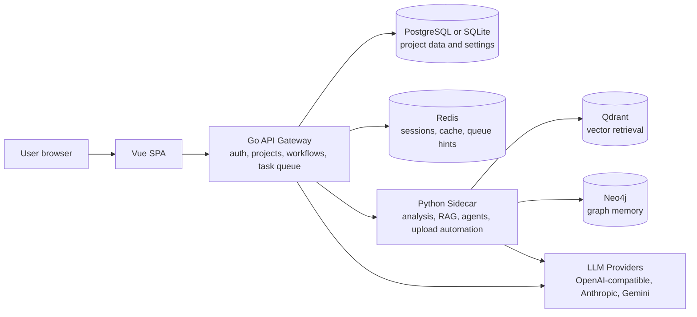

# NovelBuilder

[中文说明](README.zh-CN.md)

NovelBuilder is an AI long-form fiction workbench with a Vue UI, Go API gateway, Python agent sidecar, optional graph/vector memory, and deployment profiles from SQLite-only local mode to full all-in-one Docker.

## Architecture



The Go service owns authentication, durable data, task dispatch, static Vue hosting, and LLM profile routing. The Python sidecar owns heavier language-processing tasks, novel-source integration, graph/vector adapters, and runtime accelerator detection.

## Quick Start

All-in-one full profile:

```bash
cp .env.example .env
# edit .env and replace ADMIN_PASSWORD, DB_PASSWORD, POSTGRES_PASSWORD, and NEO4J_PASSWORD
docker compose up -d
open http://127.0.0.1:8080/setup
```

Standard profile without graph/vector services:

```bash
cp .env.example .env
# edit .env and replace ADMIN_PASSWORD and DB_PASSWORD
docker compose -f docker-compose.standard.yml up -d
```

Minimal SQLite profile:

```bash
docker compose -f docker-compose.sqlite.yml up -d
```

Source or binary local mode:

Prerequisites for source builds: Go 1.22+, Python 3.11+, Node.js 20.19+.

```bash
./scripts/install.sh
./scripts/run-local.sh
```

Windows:

```powershell
powershell -ExecutionPolicy Bypass -File .\scripts\install.ps1
powershell -ExecutionPolicy Bypass -File .\scripts\run-local.ps1
```

Open `/setup` first. It checks runtime readiness and then the in-app guide walks through model configuration, project creation, references, blueprint generation, and chapter generation.

## Deployment Profiles

| Tag | Dockerfile | Shape | Suggested resources | Notes |
| --- | --- | --- | --- | --- |
| `latest`, `full`, `YYYYMMDD` | `Dockerfile` | Single container with PostgreSQL, Redis, Qdrant, Neo4j, Python, Go, Vue, Playwright | 4 CPU, 8 GB RAM, 20 GB disk | Complete local deployment |
| `standard`, `YYYYMMDD-standard` | `Dockerfile.standard` | Single container with PostgreSQL, Redis, Python, Go, Vue | 2 CPU, 4 GB RAM, 10 GB disk | Installs base Python deps only; graph/vector/browser routes are disabled |
| `app`, `YYYYMMDD-app` | `Dockerfile.app` | App, sidecar, and Vue only | 2 CPU, 2 GB RAM plus external services | Includes graph/vector/browser Python deps for external services and upload automation |
| `sqlite` | `Dockerfile.sqlite` | Independent minimal image with SQLite and optional services disabled | 1 CPU, 2 GB RAM, 5 GB disk | Base Python deps only; intended for single-user local use |
| `no-neo4j` | `Dockerfile.no-neo4j` | Independent single container with PostgreSQL, Redis, Qdrant, browser automation, Python, Go, Vue | 3 CPU, 6 GB RAM, 15 GB disk | Omits Neo4j and graph Python/runtime deps |
| `no-qdrant` | `Dockerfile.no-qdrant` | Independent single container with PostgreSQL, Redis, Neo4j, browser automation, Python, Go, Vue | 3 CPU, 6 GB RAM, 15 GB disk | Omits Qdrant and vector Python/runtime deps |
| `no-graph-vector` | `Dockerfile.no-graph-vector` | Independent single container with PostgreSQL, Redis, Python, Go, Vue | 2 CPU, 4 GB RAM, 10 GB disk | Omits graph/vector/browser runtime deps |
| `no-redis` | `Dockerfile.no-redis` | Independent single container with PostgreSQL, Python, Go, Vue | 2 CPU, 3 GB RAM, 10 GB disk | Omits Redis service and optional graph/vector/browser runtime deps |

The release workflow builds `full`, `standard`, `app`, and each variant from its own Dockerfile. Variant Dockerfiles no longer inherit from a same-run base tag.

## Configuration

Infrastructure settings are environment variables. Application settings, LLM profiles, prompt presets, and runtime snapshots are stored in the database.

| Variable | Default | Notes |
| --- | --- | --- |
| `APP_PROFILE` | `full` in Docker, `binary` in local scripts | Displayed in setup diagnostics |
| `SERVER_HOST`, `SERVER_PORT`, `SERVER_MODE` | `0.0.0.0`, `8080`, `release` | Go gateway listener |
| `ALLOWED_ORIGINS` | localhost dev and `:8080` origins | Comma-separated CORS allowlist; use your HTTPS origin for public deployments |
| `TRUSTED_PROXIES` | empty | Comma-separated proxy CIDRs; set only when running behind a trusted reverse proxy |
| `ADMIN_USERNAME`, `ADMIN_PASSWORD` | `admin`, generated at runtime when unset | Set a strong `ADMIN_PASSWORD`; if omitted, read the temporary password from startup logs |
| `SESSION_TTL_HOURS` | `24` | Sliding session lifetime |
| `LOGIN_MAX_ATTEMPTS` | `5` | Failed login attempts before lockout |
| `LOGIN_WINDOW_SECONDS` | `300` | Counting window for failed logins |
| `LOGIN_LOCKOUT_SECONDS` | `900` | Lockout duration after too many failures |
| `DB_DRIVER` | `postgres` in containers, `sqlite` in local scripts | `sqlite`/`sqlite3` or `postgres` |
| `SQLITE_PATH` | `/data/novelbuilder.db` or `./data/novelbuilder.db` | Used when `DB_DRIVER=sqlite` |
| `DB_HOST`, `DB_PORT`, `DB_USER`, `DB_PASSWORD`, `DB_NAME`, `DB_SSLMODE` | host/user/name defaults; password required in PostgreSQL Docker profiles | Used when `DB_DRIVER=postgres` |
| `DB_MAX_OPEN_CONNS`, `DB_MAX_IDLE_CONNS`, `DB_CONN_MAX_LIFETIME_MINUTES` | `25`, `5`, `60` | Go database pool sizing; open/idle values are clamped to at least `20`/`5`, lifetime to at most `60` minutes |
| `REDIS_ENABLED`, `REDIS_ADDR`, `REDIS_URL`, `REDIS_PASSWORD`, `REDIS_DB` | profile-specific | Go uses `REDIS_ADDR`; Python uses `REDIS_URL` |
| `SIDECAR_URL`, `SIDECAR_TIMEOUT` | `http://127.0.0.1:8081`, `600` | Go to Python sidecar |
| `SIDECAR_DB_MIN_CONNS`, `SIDECAR_DB_MAX_CONNS` | `5`, `20` | Python sidecar PostgreSQL pool sizing for legacy DB-backed analysis routes |
| `NEO4J_URI`, `NEO4J_USER`, `NEO4J_PASSWORD` | profile-specific; password required when Neo4j is enabled | Empty `NEO4J_URI` disables graph services |
| `QDRANT_URL` | profile-specific | Empty disables vector services |
| `TASK_WORKERS`, `TASK_MAX_RETRIES` | `4`, `3` | Background task queue |
| `NB_ACCELERATOR` | `auto` | `auto`, `cpu`, `cuda`, `rocm`, `mps`, or `npu` |
| `VECTOR_EMBED_CONCURRENCY` | `4` | Python-sidecar embedding concurrency during vector rebuilds |

Reference uploads accept `.txt`, `.md`, `.markdown`, `.pdf`, and `.epub` files up to 50 MiB. Files are stored under `/data/uploads`, and the sidecar only reads paths inside that directory.

Authenticated API documentation is available at `/api/docs` and `/api/docs/openapi.json`. The docs routes use the same admin session middleware as the main API; CLI callers should pass `Authorization: Bearer <token>`, while direct browser access can use `/api/docs?token=<token>`.

## Build And Size Controls

```bash
VERSION=dev UPX_ENABLED=auto ./scripts/build-binaries.sh
TARGETS="linux amd64,windows amd64" ./scripts/build-binaries.sh
```

Go binaries are built with `-trimpath`, stripped symbols, and an empty build id. If `upx` is installed, Linux and Windows binary packages are compressed automatically. Docker builds use Node 24 builder images, `npm ci`, no pip cache, no Python bytecode writes, and split sidecar requirements (`base`, `graph`, `vector`, `browser`) per profile. GitHub Actions also run JavaScript actions on Node 24-compatible action versions.

## Development Checks

```bash
cd backend && go test ./...
cd python-sidecar && python3 -m py_compile main.py routes_audit.py routes_analysis.py runtime_capabilities.py
cd frontend && npm run build
```

More details:

- [Deployment matrix](docs/deployment_matrix.md)
- [Deployment matrix (English)](docs/deployment_matrix.en.md)
- [Reverse proxy example](docs/reverse_proxy.md)
- [Generation architecture](docs/generation_architecture.md)
- [Modernization todo](docs/modernization_todo.md)
