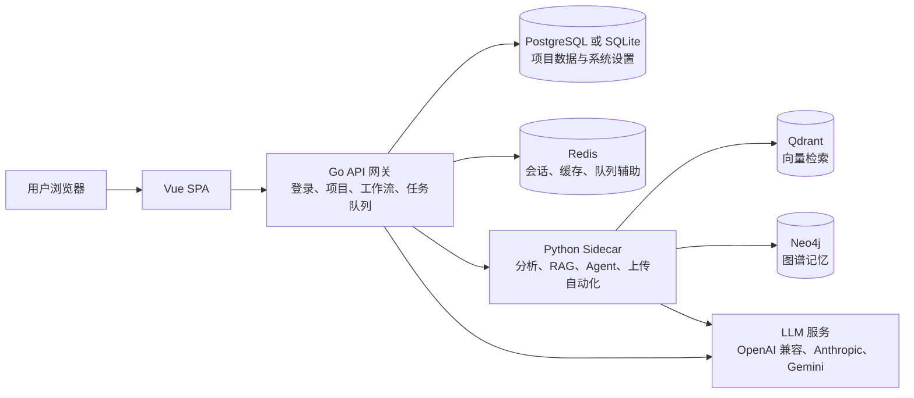

# NovelBuilder

[English README](README.md)

NovelBuilder 是一个 AI 长篇小说创作工作台，包含 Vue 前端、Go API 网关、Python Agent Sidecar、可选图谱/向量记忆，以及从 SQLite 本地模式到完整单容器 Docker 的多种部署档位。

## 架构



Go 服务负责登录、持久化数据、任务调度、静态前端托管和 LLM Profile 路由。Python Sidecar 负责参考书分析、站点导入、图谱/向量适配、Agent 流程和运行时加速器检测。

## 快速启动

完整单容器：

```bash
docker compose up -d
open http://127.0.0.1:8080/setup
```

不启用图谱/向量的标准档：

```bash
docker compose -f docker-compose.standard.yml up -d
```

最小 SQLite 档：

```bash
docker compose -f docker-compose.sqlite.yml up -d
```

源码或二进制本地模式：

源码构建需要 Go 1.22+、Python 3.11+、Node.js 20.19+。

```bash
./scripts/install.sh
./scripts/run-local.sh
```

Windows：

```powershell
powershell -ExecutionPolicy Bypass -File .\scripts\install.ps1
powershell -ExecutionPolicy Bypass -File .\scripts\run-local.ps1
```

第一次请先打开 `/setup`。该页面会检查运行状态；登录后应用内会弹出首次使用向导，按模型配置、创建项目、导入参考、生成蓝图、生成章节的顺序引导。

## Docker 档位

| 标签 | Dockerfile | 形态 | 推荐资源 | 说明 |
| --- | --- | --- | --- | --- |
| `latest`, `full`, `YYYYMMDD` | `Dockerfile` | 单容器内置 PostgreSQL、Redis、Qdrant、Neo4j、Python、Go、Vue、Playwright | 4 CPU、8 GB 内存、20 GB 磁盘 | 完整本地部署 |
| `standard`, `YYYYMMDD-standard` | `Dockerfile.standard` | 单容器内置 PostgreSQL、Redis、Python、Go、Vue | 2 CPU、4 GB 内存、10 GB 磁盘 | 体积更小的日常写作档 |
| `app`, `YYYYMMDD-app` | `Dockerfile.app` | 只包含应用、Sidecar 和前端 | 2 CPU、2 GB 内存，外部服务另算 | 多容器 compose 或托管数据库 |
| `sqlite` | `Dockerfile.sqlite` | 基于 app，使用 SQLite，并关闭可选服务 | 1 CPU、2 GB 内存、5 GB 磁盘 | 最小本地/容器档 |
| `no-neo4j`, `no-qdrant`, `no-graph-vector`, `no-redis` | overlay Dockerfile | 从 `full` 或 `standard` 派生并禁用部分运行时能力 | 视基础档位而定 | 这些标签主要禁用服务/配置；如需明显减小物理体积，优先选 `standard`、`app` 或 `sqlite` |

发布 workflow 会先构建并推送 `full`、`standard`、`app`，再用同一次运行内稳定的 `run-${GITHUB_RUN_ID}-profile` 基础 tag 构建派生镜像；Docker Hub 和 GHCR 各自引用自己的基础镜像。

## 配置

基础设施配置来自环境变量。应用设置、LLM Profile、提示词预设和运行时快照会保存在数据库中。

| 变量 | 默认值 | 说明 |
| --- | --- | --- |
| `APP_PROFILE` | Docker 为 `full`，本地脚本为 `binary` | setup 诊断页展示 |
| `SERVER_HOST`, `SERVER_PORT`, `SERVER_MODE` | `0.0.0.0`, `8080`, `release` | Go 网关监听地址 |
| `ALLOWED_ORIGINS` | 本地开发与 `:8080` 来源 | CORS 白名单，公网部署请设置为你的 HTTPS 域名 |
| `TRUSTED_PROXIES` | 空 | 可信反向代理 CIDR，只有放在可信代理后面时才设置 |
| `ADMIN_USERNAME`, `ADMIN_PASSWORD` | `spiritlhl`, 演示密码 | 公网暴露前必须修改 `ADMIN_PASSWORD` |
| `SESSION_TTL_HOURS` | `24` | 滑动会话有效期 |
| `LOGIN_MAX_ATTEMPTS` | `5` | 登录失败多少次后锁定 |
| `LOGIN_WINDOW_SECONDS` | `300` | 登录失败统计窗口 |
| `LOGIN_LOCKOUT_SECONDS` | `900` | 触发限制后的锁定时长 |
| `DB_DRIVER` | 容器默认 `postgres`，本地脚本默认 `sqlite` | `sqlite`/`sqlite3` 或 `postgres` |
| `SQLITE_PATH` | `/data/novelbuilder.db` 或 `./data/novelbuilder.db` | `DB_DRIVER=sqlite` 时使用 |
| `DB_HOST`, `DB_PORT`, `DB_USER`, `DB_PASSWORD`, `DB_NAME`, `DB_SSLMODE` | 本地 PostgreSQL 默认值 | `DB_DRIVER=postgres` 时使用 |
| `DB_MAX_OPEN_CONNS`, `DB_MAX_IDLE_CONNS` | `25`, `5` | Go 数据库连接池 |
| `REDIS_ENABLED`, `REDIS_ADDR`, `REDIS_URL`, `REDIS_PASSWORD`, `REDIS_DB` | 按档位设置 | Go 使用 `REDIS_ADDR`，Python 使用 `REDIS_URL` |
| `SIDECAR_URL`, `SIDECAR_TIMEOUT` | `http://127.0.0.1:8081`, `600` | Go 调用 Python Sidecar |
| `NEO4J_URI`, `NEO4J_USER`, `NEO4J_PASSWORD` | 按档位设置 | `NEO4J_URI` 为空时关闭图谱能力 |
| `QDRANT_URL` | 按档位设置 | 为空时关闭向量能力 |
| `TASK_WORKERS`, `TASK_MAX_RETRIES` | `4`, `3` | 后台任务队列 |
| `NB_ACCELERATOR` | `auto` | 可设为 `auto`、`cpu`、`cuda`、`rocm`、`npu` |

## 构建与瘦身

```bash
VERSION=dev UPX_ENABLED=auto ./scripts/build-binaries.sh
TARGETS="linux amd64,windows amd64" ./scripts/build-binaries.sh
```

Go 二进制默认使用 `-trimpath`、删除符号表、清空 build id。如果本机或 CI 安装了 `upx`，Linux 和 Windows 二进制包会自动压缩。Docker 构建在 CI 中传入 `UPX_ENABLED=true`，并使用 `npm ci`、禁用 pip 缓存、避免 Python bytecode 写入，同时缩小 Docker build context。

## 验证命令

```bash
cd backend && go test ./...
cd python-sidecar && python3 -m py_compile main.py routes_audit.py routes_analysis.py runtime_capabilities.py
cd frontend && npm run build
```

更多说明：

- [部署矩阵](docs/deployment_matrix.md)
- [生成架构](docs/generation_architecture.md)
- [现代化 todo](docs/modernization_todo.md)
