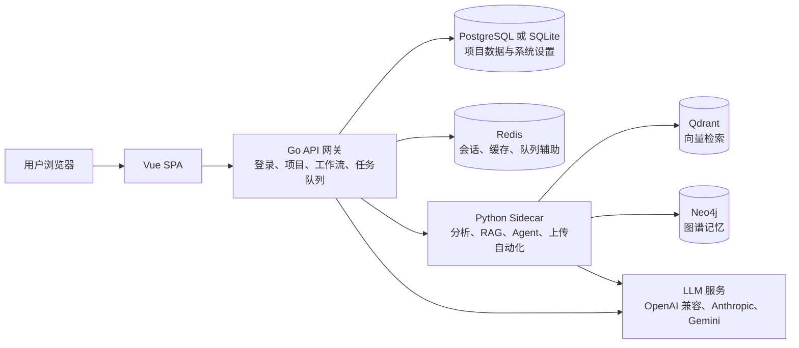

# NovelBuilder

[English README](README.md)

NovelBuilder 是一个 AI 长篇小说创作工作台，包含 Vue 前端、Go API 网关、Python Agent Sidecar、可选图谱/向量记忆，以及从 SQLite 本地模式到完整单容器 Docker 的多种部署档位。

## 架构



Go 服务负责登录、持久化数据、任务调度、静态前端托管和 LLM Profile 路由。Python Sidecar 负责参考书分析、站点导入、图谱/向量适配、Agent 流程和运行时加速器检测。

## 快速启动

完整单容器：

```bash
cp .env.example .env
# 编辑 .env，替换 ADMIN_PASSWORD、DB_PASSWORD、POSTGRES_PASSWORD、NEO4J_PASSWORD
docker compose up -d
open http://127.0.0.1:8080/setup
```

不启用图谱/向量的标准档：

```bash
cp .env.example .env
# 编辑 .env，替换 ADMIN_PASSWORD 和 DB_PASSWORD
docker compose -f docker-compose.standard.yml up -d
```

最小 SQLite 档：

```bash
docker compose -f docker-compose.sqlite.yml up -d
```

源码或二进制本地模式：

源码构建需要 Go 1.22+、Python 3.11+、Node.js 20.19+。

```bash
./scripts/install.sh
./scripts/run-local.sh
```

Windows：

```powershell
powershell -ExecutionPolicy Bypass -File .\scripts\install.ps1
powershell -ExecutionPolicy Bypass -File .\scripts\run-local.ps1
```

第一次请先打开 `/setup`。该页面会检查运行状态；登录后应用内会弹出首次使用向导，按模型配置、创建项目、导入参考、生成蓝图、生成章节的顺序引导。

## Docker 档位

| 标签 | Dockerfile | 形态 | 推荐资源 | 说明 |
| --- | --- | --- | --- | --- |
| `latest`, `full`, `YYYYMMDD` | `Dockerfile` | 单容器内置 PostgreSQL、Redis、Qdrant、Neo4j、Python、Go、Vue、Playwright | 4 CPU、8 GB 内存、20 GB 磁盘 | 完整本地部署 |
| `standard`, `YYYYMMDD-standard` | `Dockerfile.standard` | 单容器内置 PostgreSQL、Redis、Python、Go、Vue | 2 CPU、4 GB 内存、10 GB 磁盘 | 只安装 base Python 依赖，关闭图谱/向量/浏览器能力 |
| `app`, `YYYYMMDD-app` | `Dockerfile.app` | 只包含应用、Sidecar 和前端 | 2 CPU、2 GB 内存，外部服务另算 | 保留外部 Neo4j/Qdrant 和浏览器自动化所需依赖 |
| `sqlite` | `Dockerfile.sqlite` | 独立最小镜像，使用 SQLite，并关闭可选服务 | 1 CPU、2 GB 内存、5 GB 磁盘 | 只安装 base Python 依赖，适合单用户本地使用 |
| `no-neo4j` | `Dockerfile.no-neo4j` | 独立单容器内置 PostgreSQL、Redis、Qdrant、浏览器自动化、Python、Go、Vue | 3 CPU、6 GB 内存、15 GB 磁盘 | 不安装 Neo4j 和 graph Python/runtime 依赖 |
| `no-qdrant` | `Dockerfile.no-qdrant` | 独立单容器内置 PostgreSQL、Redis、Neo4j、浏览器自动化、Python、Go、Vue | 3 CPU、6 GB 内存、15 GB 磁盘 | 不安装 Qdrant 和 vector Python/runtime 依赖 |
| `no-graph-vector` | `Dockerfile.no-graph-vector` | 独立单容器内置 PostgreSQL、Redis、Python、Go、Vue | 2 CPU、4 GB 内存、10 GB 磁盘 | 不安装图谱/向量/浏览器 runtime 依赖 |
| `no-redis` | `Dockerfile.no-redis` | 独立单容器内置 PostgreSQL、Python、Go、Vue | 2 CPU、3 GB 内存、10 GB 磁盘 | 不安装 Redis 服务，也不安装图谱/向量/浏览器 runtime 依赖 |

发布 workflow 会分别从各自 Dockerfile 构建 `full`、`standard`、`app` 和所有变体镜像。变体 Dockerfile 不再继承同一次运行内的基础 tag。

## 配置

基础设施配置来自环境变量。应用设置、LLM Profile、提示词预设和运行时快照会保存在数据库中。

| 变量 | 默认值 | 说明 |
| --- | --- | --- |
| `APP_PROFILE` | Docker 为 `full`，本地脚本为 `binary` | setup 诊断页展示 |
| `SERVER_HOST`, `SERVER_PORT`, `SERVER_MODE` | `0.0.0.0`, `8080`, `release` | Go 网关监听地址 |
| `ALLOWED_ORIGINS` | 本地开发与 `:8080` 来源 | CORS 白名单，公网部署请设置为你的 HTTPS 域名 |
| `TRUSTED_PROXIES` | 空 | 可信反向代理 CIDR，只有放在可信代理后面时才设置 |
| `ADMIN_USERNAME`, `ADMIN_PASSWORD` | `admin`，未设置时启动期临时生成 | 请设置强 `ADMIN_PASSWORD`；未设置时从启动日志读取临时密码 |
| `SESSION_TTL_HOURS` | `24` | 滑动会话有效期 |
| `LOGIN_MAX_ATTEMPTS` | `5` | 登录失败多少次后锁定 |
| `LOGIN_WINDOW_SECONDS` | `300` | 登录失败统计窗口 |
| `LOGIN_LOCKOUT_SECONDS` | `900` | 触发限制后的锁定时长 |
| `DB_DRIVER` | 容器默认 `postgres`，本地脚本默认 `sqlite` | `sqlite`/`sqlite3` 或 `postgres` |
| `SQLITE_PATH` | `/data/novelbuilder.db` 或 `./data/novelbuilder.db` | `DB_DRIVER=sqlite` 时使用 |
| `DB_HOST`, `DB_PORT`, `DB_USER`, `DB_PASSWORD`, `DB_NAME`, `DB_SSLMODE` | host/user/name 有默认值；PostgreSQL Docker 档必须显式设置密码 | `DB_DRIVER=postgres` 时使用 |
| `DB_MAX_OPEN_CONNS`, `DB_MAX_IDLE_CONNS`, `DB_CONN_MAX_LIFETIME_MINUTES` | `25`, `5`, `60` | Go 数据库连接池；open/idle 最低归一化为 `20`/`5`，生命周期最长 `60` 分钟 |
| `REDIS_ENABLED`, `REDIS_ADDR`, `REDIS_URL`, `REDIS_PASSWORD`, `REDIS_DB` | 按档位设置 | Go 使用 `REDIS_ADDR`，Python 使用 `REDIS_URL` |
| `SIDECAR_URL`, `SIDECAR_TIMEOUT` | `http://127.0.0.1:8081`, `600` | Go 调用 Python Sidecar |
| `SIDECAR_DB_MIN_CONNS`, `SIDECAR_DB_MAX_CONNS` | `5`, `20` | Python Sidecar 旧版数据库分析路由使用的 PostgreSQL 连接池配置 |
| `NEO4J_URI`, `NEO4J_USER`, `NEO4J_PASSWORD` | 按档位设置；启用 Neo4j 时必须显式设置密码 | `NEO4J_URI` 为空时关闭图谱能力 |
| `QDRANT_URL` | 按档位设置 | 为空时关闭向量能力 |
| `TASK_WORKERS`, `TASK_MAX_RETRIES` | `4`, `3` | 后台任务队列 |
| `NB_ACCELERATOR` | `auto` | 可设为 `auto`、`cpu`、`cuda`、`rocm`、`mps`、`npu` |
| `VECTOR_EMBED_CONCURRENCY` | `4` | Python Sidecar 重建向量时的本地 embedding 并发度 |

参考文件上传支持 `.txt`、`.md`、`.markdown`、`.pdf`、`.epub`，单文件上限 50 MiB。上传文件统一保存到 `/data/uploads`，Sidecar 只允许读取该目录内的路径。

受保护的 API 文档位于 `/api/docs` 和 `/api/docs/openapi.json`。文档路由使用与主 API 相同的管理员会话中间件；命令行调用请传 `Authorization: Bearer <token>`，直接浏览器访问可使用 `/api/docs?token=<token>`。

## 构建与瘦身

```bash
VERSION=dev UPX_ENABLED=auto ./scripts/build-binaries.sh
TARGETS="linux amd64,windows amd64" ./scripts/build-binaries.sh
```

Go 二进制默认使用 `-trimpath`、删除符号表、清空 build id。如果本机或 CI 安装了 `upx`，Linux 和 Windows 二进制包会自动压缩。Docker 构建使用 Node 24 builder 镜像、`npm ci`、禁用 pip 缓存、避免 Python bytecode 写入，并按档位组合 sidecar 依赖（`base`、`graph`、`vector`、`browser`）。GitHub Actions 已升级到 Node 24 兼容的 action 版本。

当前数据库初始化以新结构为准。大纲排序索引已从“项目+层级+排序唯一”改为普通排序索引，以支持父子节点内拖拽重排；如果沿用旧库遇到旧唯一索引冲突，请按新部署重新初始化数据库。

## 验证命令

```bash
cd backend && go test ./...
cd python-sidecar && python3 -m py_compile main.py routes_audit.py routes_analysis.py runtime_capabilities.py
cd frontend && npm run build
```

更多说明：

- [部署矩阵](docs/deployment_matrix.md)
- [部署矩阵（英文）](docs/deployment_matrix.en.md)
- [反向代理示例](docs/reverse_proxy.md)
- [生成架构](docs/generation_architecture.md)
- [现代化 todo](docs/modernization_todo.md)
