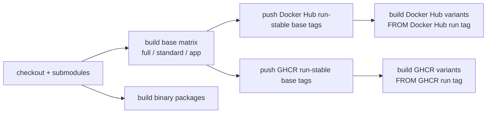

# Deployment Matrix

## Image Profiles

| Profile | Use case | Size goal | Data components | Optional capabilities |
| --- | --- | --- | --- | --- |
| `full` | Complete local workstation | Largest | PostgreSQL, Redis, Qdrant, Neo4j | RAG, graph memory, Playwright upload automation |
| `standard` | Daily writing on smaller hosts | Medium | PostgreSQL, Redis | Base Python deps only; graph/vector/browser routes disabled |
| `app` | Multi-container or managed services | Small | External PostgreSQL/Redis/Qdrant/Neo4j | Graph/vector deps installed; external services decide what is enabled; no browser automation |
| `sqlite` | Single-user trial or offline local use | Smallest | SQLite | Independent minimal image; base Python deps only; Redis/Qdrant/Neo4j disabled |
| `no-*` overlays | Disable a component at runtime | Close to base image | Inherits `full` or `standard` | Uses environment and supervisord overrides |

The overlay images (`no-neo4j`, `no-qdrant`, `no-graph-vector`, `no-redis`) mostly disable runtime services. Choose `standard`, `app`, or `sqlite` when physical image size matters.

## Sidecar Requirements

| File | Profiles | Contents |
| --- | --- | --- |
| `requirements-base.txt` | all | FastAPI, DB/Redis, LangGraph/LangChain, reference analysis, novel-source import |
| `requirements-graph.txt` | `full`, `app` | Graphiti and Neo4j driver |
| `requirements-vector.txt` | `full`, `app` | Qdrant, sentence-transformers, torch pin |
| `requirements-browser.txt` | `full` | Playwright upload automation |

When graph or vector services are disabled, those APIs return 503 while core writing flows, task queue, chapter generation, and reference import continue to work. The SQLite profile runs background tasks with one worker by default to avoid SQLite write-lock contention.

## CI Order

Variant images depend on same-run base tags, so the workflow builds `full`, `standard`, and `app` first and then builds overlays. Docker Hub and GHCR each use their own `BASE_IMAGE`.

The workflow uses Node 24-compatible actions, including `actions/checkout@v6`, `actions/setup-go@v6`, `actions/setup-node@v6`, `actions/upload-artifact@v6`, and current Docker official build/login/setup actions. It also sets `FORCE_JAVASCRIPT_ACTIONS_TO_NODE24=true`.

## Public Deployment

- Set a strong `ADMIN_PASSWORD`; never expose the demo password.
- Set `ALLOWED_ORIGINS=https://your-domain`.
- Set `TRUSTED_PROXIES` only to real reverse-proxy CIDRs.
- Let the reverse proxy own HTTPS, compression, access logs, and request-body limits.
- Reference uploads are limited to 50 MiB and to text, Markdown, PDF, and EPUB.
- SQLite is for single-user use. Use PostgreSQL for long-running or multi-user projects.
- The current schema assumes fresh initialization. Outline ordering now uses a normal index rather than the old project-level unique order constraint so drag-and-drop reordering can persist.
