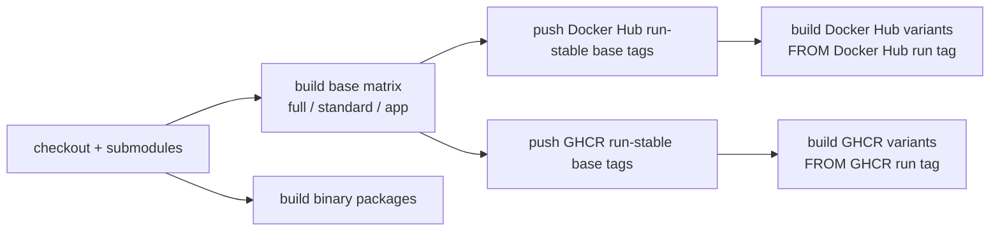

# Deployment Matrix

## Image Profiles

| Profile | Use case | Size goal | Data components | Optional capabilities |
| --- | --- | --- | --- | --- |
| `full` | Complete local workstation | Largest | PostgreSQL, Redis, Qdrant, Neo4j | RAG, graph memory, Playwright upload automation |
| `standard` | Daily writing on smaller hosts | Medium | PostgreSQL, Redis | Base Python deps only; graph/vector/browser routes disabled |
| `app` | Multi-container or managed services | Small | External PostgreSQL/Redis/Qdrant/Neo4j | Graph/vector deps installed; external services decide what is enabled; no browser automation |
| `sqlite` | Single-user trial or offline local use | Smallest | SQLite | Independent minimal image; base Python deps only; Redis/Qdrant/Neo4j disabled |
| `no-neo4j` | Keep RAG/vector and browser upload automation, disable graph memory | Large | PostgreSQL, Redis, Qdrant | Independent image with vector/browser deps, no Neo4j/Graph runtime |
| `no-qdrant` | Keep graph memory and browser upload automation, disable vector search | Large | PostgreSQL, Redis, Neo4j | Independent image with graph/browser deps, no Qdrant/Vector runtime |
| `no-graph-vector` | Disable graph, vector and browser automation | Medium | PostgreSQL, Redis | Independent image with base Python deps only |
| `no-redis` | Disable Redis, graph, vector and browser automation | Medium-small | PostgreSQL | Independent image without redis-server |

All `no-*` profiles are now independent single-container builds, so disabled components no longer require their passwords or ship their system/Python runtime. Choose `sqlite` for the smallest physical image, or `standard`, `no-graph-vector`, or `no-redis` when PostgreSQL is required without optional capabilities.

## Sidecar Requirements

| File | Profiles | Contents |
| --- | --- | --- |
| `requirements-base.txt` | all | FastAPI, DB/Redis, LangGraph/LangChain, reference analysis, novel-source import |
| `requirements-graph.txt` | `full`, `app` | Graphiti and Neo4j driver |
| `requirements-vector.txt` | `full`, `app` | Qdrant, sentence-transformers, torch pin |
| `requirements-browser.txt` | `full`, `no-neo4j`, `no-qdrant` | Playwright upload automation |

`no-neo4j` installs base + vector + browser dependencies. `no-qdrant` installs base + graph + browser dependencies. This keeps the non-disabled heavy capability available while omitting the disabled component's Python and system runtime.

When graph or vector services are disabled, those APIs return 503 while core writing flows, task queue, chapter generation, and reference import continue to work. The SQLite profile runs background tasks with one worker by default to avoid SQLite write-lock contention.

## CI Order

All variant Dockerfiles now build independently and no longer depend on a same-run `BASE_IMAGE`. The workflow still builds base profiles before variants to keep publish ordering and tag semantics clear.

The workflow uses Node 24-compatible actions, including `actions/checkout@v6`, `actions/setup-go@v6`, `actions/setup-node@v6`, `actions/upload-artifact@v6`, and current Docker official build/login/setup actions. It also sets `FORCE_JAVASCRIPT_ACTIONS_TO_NODE24=true`.

## Public Deployment

- Copy `.env.example` to `.env` and set strong random values for `ADMIN_PASSWORD`, `DB_PASSWORD`/`POSTGRES_PASSWORD`, and `NEO4J_PASSWORD`; PostgreSQL/Neo4j Docker profiles no longer ship fixed password defaults.
- Set a strong `ADMIN_PASSWORD`; when it is omitted, the app generates a process-local temporary password and writes it to startup logs.
- Set `ALLOWED_ORIGINS=https://your-domain`.
- Set `TRUSTED_PROXIES` only to real reverse-proxy CIDRs.
- Let the reverse proxy own HTTPS, compression, access logs, and request-body limits.
- Reference uploads are limited to 50 MiB and to text, Markdown, PDF, and EPUB.
- SQLite is for single-user use. Use PostgreSQL for long-running or multi-user projects.
- The current schema assumes fresh initialization. Outline ordering now uses a normal index rather than the old project-level unique order constraint so drag-and-drop reordering can persist.
