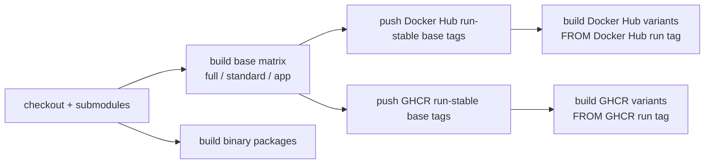

# 部署矩阵

## 镜像档位

| 档位 | 推荐场景 | 体积取向 | 数据组件 | 可选能力 |
| --- | --- | --- | --- | --- |
| `full` | 单机完整体验、本地工作站 | 最大 | PostgreSQL、Redis、Qdrant、Neo4j | RAG、图谱、Playwright 上传自动化 |
| `standard` | 常规写作、低资源 VPS | 中等 | PostgreSQL、Redis | 只安装 base Python 依赖，关闭 Qdrant/Neo4j/浏览器 |
| `app` | 多容器或托管数据库 | 小 | 外部 PostgreSQL/Redis/Qdrant/Neo4j | 安装 graph/vector 依赖，外部服务决定是否启用，不内置浏览器 |
| `sqlite` | 单人试用、本地离线、最小部署 | 最小 | SQLite | 独立最小镜像，只安装 base Python 依赖，关闭 Redis、Qdrant、Neo4j |
| `no-*` overlay | 保留基础镜像但禁用某些服务 | 与基础档接近 | 继承 `full` 或 `standard` | 通过环境变量和 supervisord 配置禁用 |

`no-neo4j`、`no-qdrant`、`no-graph-vector`、`no-redis` 是派生配置镜像，主要解决“运行时不要启动某组件”的需求。若目标是显著减小物理体积，优先选择 `standard`、`app` 或 `sqlite`。

Python Sidecar 依赖按能力拆分：

| 文件 | 适用档位 | 内容 |
| --- | --- | --- |
| `requirements-base.txt` | 全部档位 | FastAPI、DB/Redis、LangGraph/LangChain、参考分析、小说站点导入 |
| `requirements-graph.txt` | `full`、`app` | Graphiti 和 Neo4j 驱动 |
| `requirements-vector.txt` | `full`、`app` | Qdrant、sentence-transformers、torch pin |
| `requirements-browser.txt` | `full` | Playwright 上传自动化 |

图谱或向量服务被禁用时，相关 API 返回 503；主写作流程、任务队列、章节生成和参考导入仍可运行。SQLite 档默认单 worker 执行后台任务，避免 SQLite 写锁导致并发任务互相阻塞。

## CI 构建顺序



派生镜像不能和基础镜像同一个 matrix 并行启动，否则会在 `FROM spiritlhl/novelbuilder:full`、`standard` 或 `app` 时引用到尚未推送的 tag。当前 workflow 用 `needs: docker-base` 保证顺序，并为每个 registry 生成独立的 `BASE_IMAGE`。派生镜像使用 `run-${GITHUB_RUN_ID}-profile` 基础 tag，避免长时间构建跨日期时引用错误的日期 tag。

Actions 已升级到 Node 24 兼容版本：`actions/checkout@v6`、`actions/setup-go@v6`、`actions/setup-node@v6`、`actions/upload-artifact@v6`、Docker 官方 build/login/setup actions 的新版，并设置 `FORCE_JAVASCRIPT_ACTIONS_TO_NODE24=true`。

## 公网部署建议

- 设置强 `ADMIN_PASSWORD`，不要使用默认演示密码。
- 设置 `ALLOWED_ORIGINS=https://你的域名`，避免任意来源调用 API。
- 如果在 Nginx、Caddy、Traefik 后面运行，按实际代理网段设置 `TRUSTED_PROXIES`。
- 让反向代理负责 HTTPS、压缩、访问日志和请求体大小限制。
- SQLite 档只建议单用户使用；多人或长期项目建议 PostgreSQL。
- 参考文件上传限制为 50 MiB，支持文本、Markdown、PDF 和 EPUB；反向代理仍应设置合理请求体大小上限。
- 新库初始化不保留旧索引兼容。大纲排序已改为普通索引以支持拖拽重排；沿用旧库时如碰到旧唯一索引，请删除旧 DB 后重新初始化。

## 本地二进制包

`scripts/build-binaries.sh` 会打包 Go 后端、Vue `frontend/dist`、Python Sidecar 源码和运行脚本。默认使用 SQLite：

```bash
VERSION=dev UPX_ENABLED=auto ./scripts/build-binaries.sh
```

可用 `TARGETS` 限制目标平台：

```bash
TARGETS="linux amd64,linux arm64" ./scripts/build-binaries.sh
```

如果安装了 `upx`，Linux 和 Windows 二进制会自动压缩。macOS 产物默认跳过 UPX，避免破坏签名和系统校验流程。
