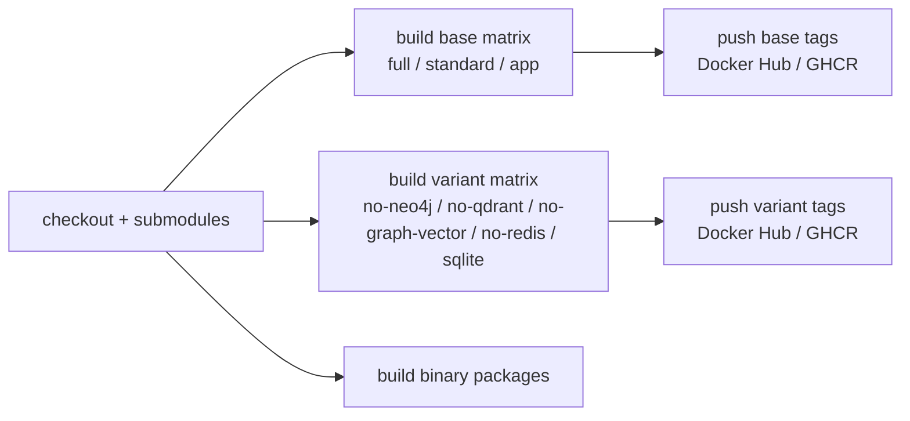

# 部署矩阵

## 镜像档位

| 档位 | 推荐场景 | 体积取向 | 数据组件 | 可选能力 |
| --- | --- | --- | --- | --- |
| `full` | 单机完整体验、本地工作站 | 最大 | PostgreSQL、Redis、Qdrant、Neo4j | RAG、图谱、Playwright 上传自动化 |
| `standard` | 常规写作、低资源 VPS | 中等 | PostgreSQL、Redis | 只安装 base Python 依赖，关闭 Qdrant/Neo4j/浏览器 |
| `app` | 多容器或托管数据库 | 小 | 外部 PostgreSQL/Redis/Qdrant/Neo4j | 安装 graph/vector/browser 依赖，外部服务决定是否启用 |
| `sqlite` | 单人试用、本地离线、最小部署 | 最小 | SQLite | 独立最小镜像，只安装 base Python 依赖，关闭 Redis、Qdrant、Neo4j |
| `no-neo4j` | 需要 RAG/向量与浏览器上传，但不启用图谱 | 较大 | PostgreSQL、Redis、Qdrant | 独立镜像，安装 vector/browser 依赖，不安装 Neo4j/Graph |
| `no-qdrant` | 需要图谱与浏览器上传，但不启用向量检索 | 较大 | PostgreSQL、Redis、Neo4j | 独立镜像，安装 graph/browser 依赖，不安装 Qdrant/Vector |
| `no-graph-vector` | 不启用图谱、向量和浏览器自动化 | 中等 | PostgreSQL、Redis | 独立镜像，只安装 base Python 依赖 |
| `no-redis` | 不启用 Redis、图谱、向量和浏览器自动化 | 中等偏小 | PostgreSQL | 独立镜像，不安装 redis-server |

所有 `no-*` 档位均为独立单容器构建，禁用组件不会再要求对应密码或携带对应系统/Python runtime。若目标是最小物理体积，优先选择 `sqlite`；若需要 PostgreSQL 但不需要可选能力，可选 `standard`、`no-graph-vector` 或 `no-redis`。

Python Sidecar 依赖按能力拆分：

| 文件 | 适用档位 | 内容 |
| --- | --- | --- |
| `requirements-base.txt` | 全部档位 | FastAPI、DB/Redis、LangGraph/LangChain、参考分析、小说站点导入 |
| `requirements-graph.txt` | `full`、`app`、`no-qdrant` | Graphiti 和 Neo4j 驱动 |
| `requirements-vector.txt` | `full`、`app`、`no-neo4j` | Qdrant、sentence-transformers、torch pin |
| `requirements-browser.txt` | `full`、`app`、`no-neo4j`、`no-qdrant` | Playwright/Camoufox 上传自动化 |

`no-neo4j` 安装 base + vector + browser；`no-qdrant` 安装 base + graph + browser。这样两者保留各自未禁用的重能力，同时避免把被禁用组件的 Python 和系统依赖打进镜像。

图谱或向量服务被禁用时，相关 API 返回 503；主写作流程、任务队列、章节生成和参考导入仍可运行。SQLite 档默认单 worker 执行后台任务，避免 SQLite 写锁导致并发任务互相阻塞。

## CI 构建顺序



所有变体 Dockerfile 都独立构建，不再依赖同一次运行内的 `BASE_IMAGE`。当前 workflow 会并行构建基础档和变体档；Docker cache scope 按 profile、accelerator 和 platform 拆分，避免 CPU/CUDA 或 amd64/arm64 层互相污染。

Actions 已升级到 Node 24 兼容版本：`actions/checkout@v6`、`actions/setup-go@v6`、`actions/setup-node@v6`、`actions/upload-artifact@v6`、Docker 官方 build/login/setup actions 的新版，并设置 `FORCE_JAVASCRIPT_ACTIONS_TO_NODE24=true`。

## 公网部署建议

- 复制 `.env.example` 为 `.env`，并为 `ADMIN_PASSWORD`、`DB_PASSWORD`/`POSTGRES_PASSWORD`、`NEO4J_PASSWORD` 填写强随机值；PostgreSQL/Neo4j Docker 档不会再提供固定默认密码。
- 设置强 `ADMIN_PASSWORD`；未设置时应用只生成当前进程可用的临时密码，并写入启动日志。
- 设置 `ALLOWED_ORIGINS=https://你的域名`，避免任意来源调用 API。
- 如果在 Nginx、Caddy、Traefik 后面运行，按实际代理网段设置 `TRUSTED_PROXIES`。
- 让反向代理负责 HTTPS、压缩、访问日志和请求体大小限制。
- SQLite 档只建议单用户使用；多人或长期项目建议 PostgreSQL。
- 参考文件上传限制为 50 MiB，支持文本、Markdown、PDF 和 EPUB；反向代理仍应设置合理请求体大小上限。
- 新库初始化不保留旧索引兼容。大纲排序已改为普通索引以支持拖拽重排；沿用旧库时如碰到旧唯一索引，请删除旧 DB 后重新初始化。

## 本地二进制包

`scripts/build-binaries.sh` 会打包 Go 后端、Vue `frontend/dist`、Python Sidecar 源码和运行脚本。默认使用 SQLite：

```bash
VERSION=dev UPX_ENABLED=auto ./scripts/build-binaries.sh
```

可用 `TARGETS` 限制目标平台：

```bash
TARGETS="linux amd64,linux arm64" ./scripts/build-binaries.sh
```

如果安装了 `upx`，Linux 和 Windows 二进制会自动压缩。macOS 产物默认跳过 UPX，避免破坏签名和系统校验流程。
