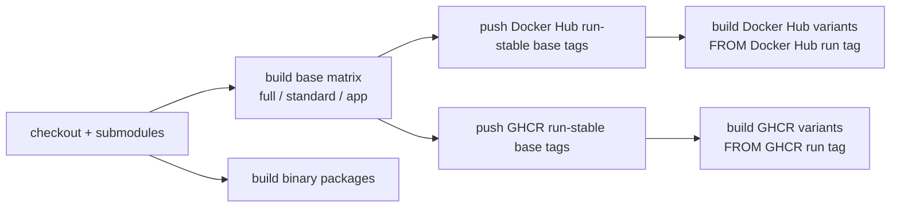

# 部署矩阵

## 镜像档位

| 档位 | 推荐场景 | 体积取向 | 数据组件 | 可选能力 |
| --- | --- | --- | --- | --- |
| `full` | 单机完整体验、本地工作站 | 最大 | PostgreSQL、Redis、Qdrant、Neo4j | RAG、图谱、Playwright 上传自动化 |
| `standard` | 常规写作、低资源 VPS | 中等 | PostgreSQL、Redis | 关闭内置 Qdrant/Neo4j/浏览器 |
| `app` | 多容器或托管数据库 | 小 | 外部 PostgreSQL/Redis/Qdrant/Neo4j | 由外部服务决定 |
| `sqlite` | 单人试用、本地离线、最小部署 | 最小 | SQLite | 默认关闭 Redis、Qdrant、Neo4j |
| `no-*` overlay | 保留基础镜像但禁用某些服务 | 与基础档接近 | 继承 `full` 或 `standard` | 通过环境变量和 supervisord 配置禁用 |

`no-neo4j`、`no-qdrant`、`no-graph-vector`、`no-redis` 是派生配置镜像，主要解决“运行时不要启动某组件”的需求。若目标是显著减小物理体积，优先选择 `standard`、`app` 或 `sqlite`。

## CI 构建顺序



派生镜像不能和基础镜像同一个 matrix 并行启动，否则会在 `FROM spiritlhl/novelbuilder:full`、`standard` 或 `app` 时引用到尚未推送的 tag。当前 workflow 用 `needs: docker-base` 保证顺序，并为每个 registry 生成独立的 `BASE_IMAGE`。派生镜像使用 `run-${GITHUB_RUN_ID}-profile` 基础 tag，避免长时间构建跨日期时引用错误的日期 tag。

## 公网部署建议

- 设置强 `ADMIN_PASSWORD`，不要使用默认演示密码。
- 设置 `ALLOWED_ORIGINS=https://你的域名`，避免任意来源调用 API。
- 如果在 Nginx、Caddy、Traefik 后面运行，按实际代理网段设置 `TRUSTED_PROXIES`。
- 让反向代理负责 HTTPS、压缩、访问日志和请求体大小限制。
- SQLite 档只建议单用户使用；多人或长期项目建议 PostgreSQL。

## 本地二进制包

`scripts/build-binaries.sh` 会打包 Go 后端、Vue `frontend/dist`、Python Sidecar 源码和运行脚本。默认使用 SQLite：

```bash
VERSION=dev UPX_ENABLED=auto ./scripts/build-binaries.sh
```

可用 `TARGETS` 限制目标平台：

```bash
TARGETS="linux amd64,linux arm64" ./scripts/build-binaries.sh
```

如果安装了 `upx`，Linux 和 Windows 二进制会自动压缩。macOS 产物默认跳过 UPX，避免破坏签名和系统校验流程。
