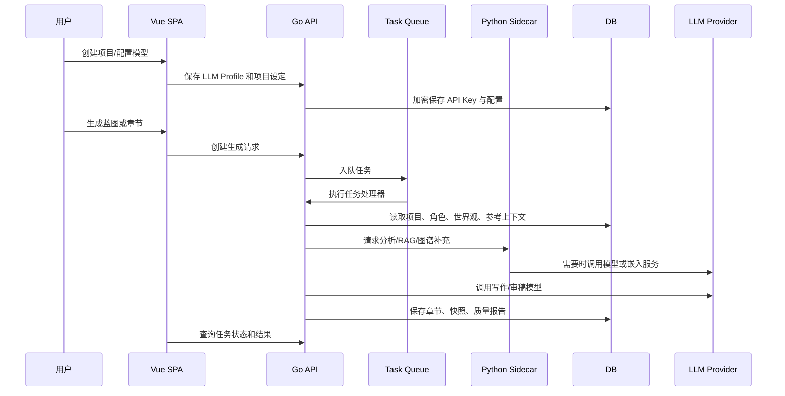
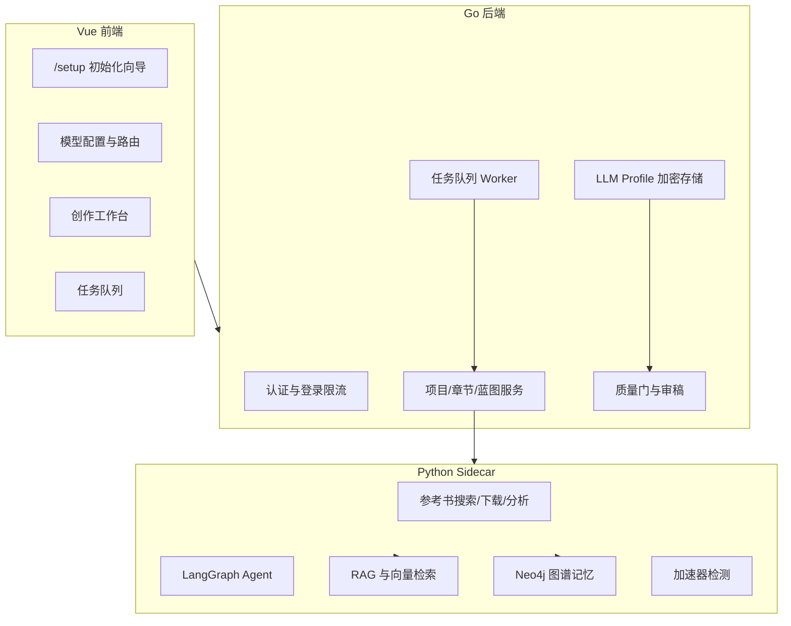

# 生成架构

NovelBuilder 的生成流程分成“配置、规划、执行、审稿、固化”五层。Go 侧负责稳定的业务事务和任务调度，Python Sidecar 负责重型分析、RAG、图谱/向量和 Agent 编排。

## 端到端流程

## 关键组件

## 任务顺序原则

1. 初始化数据库和系统设置后，才注册后台任务处理器。
2. 所有任务处理器注册完成后，才启动 Worker。
3. Docker Actions 先构建基础镜像，再构建派生镜像。
4. 首次使用先配置 LLM Profile，再创建项目和生成任务。

这四个顺序分别避免数据库缺表、任务找不到 handler、派生镜像引用不存在基础 tag，以及用户在未配置模型时直接触发失败任务。
